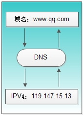
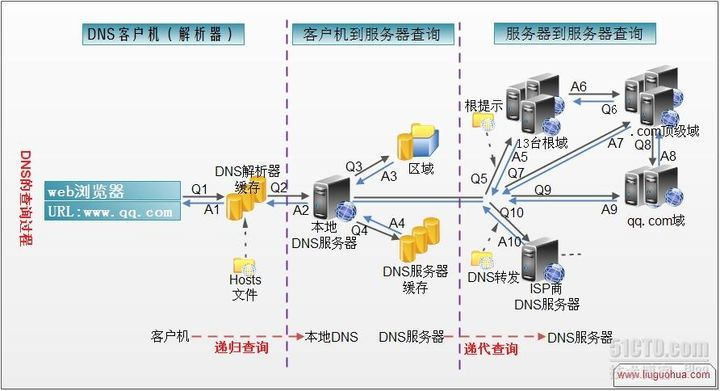
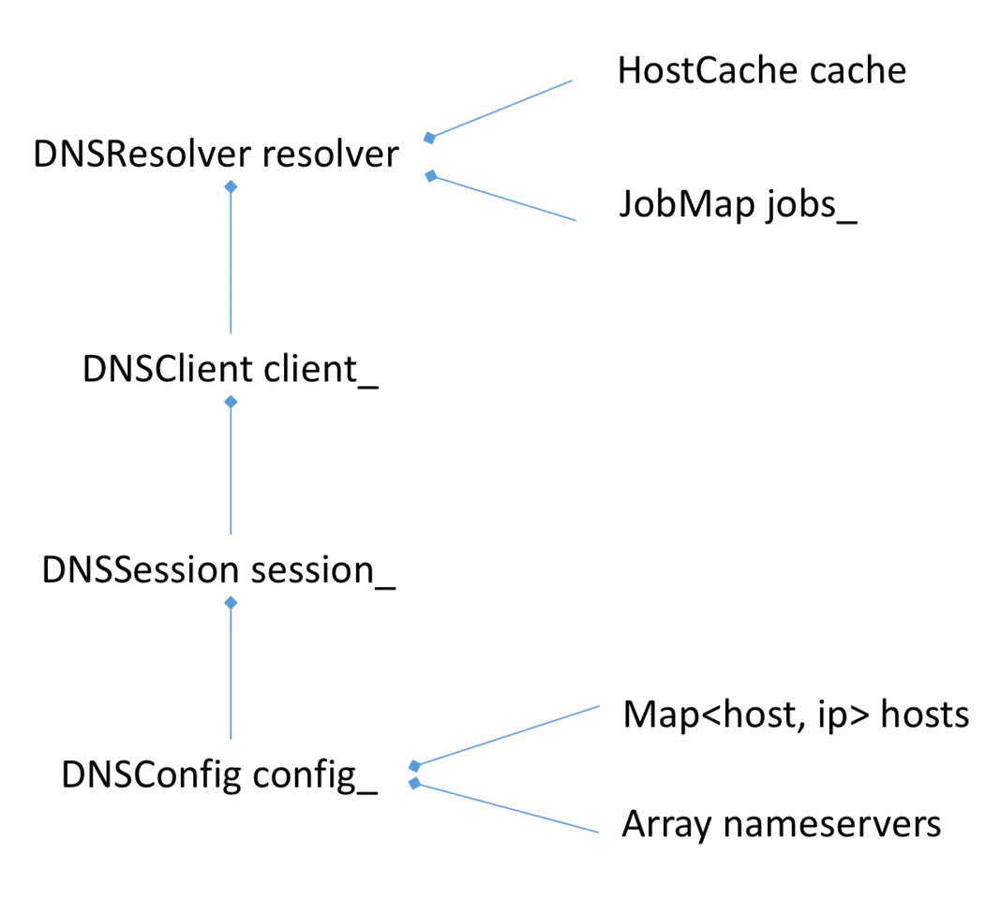

# 你不能不懂的DNS解析原理

[[toc]]

## 什么是DNS？

DNS( Domain Name System)是“域名系统”的英文缩写，是一种组织成域层次结构的计算机和网络服务命名系统，它用于TCP/IP网络，它所提供的服务是用来将主机名和域名转换为IP地址的工作。DNS就是这样的一位“翻译官”，它的基本工作原理可用下图来表示

DNS是一种由分层的DNS服务器实现的分布式数据库，DNS运行在UDP上，使用53端口

## DNS的获取过程

- 用户主机上运行着DNS的客户端，就是我们的PC机或者手机客户端运行着DNS客户端
- 浏览器将接收到的url中抽取出域名字段，就是访问的主机名，比如`http://www.baidu.com/`
- DNS客户机端向DNS服务器端发送一份查询报文，报文中包含着要访问的主机名字段（中间包括一些列缓存查询以及分布式DNS集群的工作）
- 该DNS客户机最终会收到一份回答报文，其中包含有该主机名对应的IP地址
- 一旦该浏览器收到来自DNS的IP地址，就可以向该IP地址定位的HTTP服务器发起TCP连接

## DNS的解析过程

- DNS查询是操作系统自己做的
- 浏览器输入`www.qq.com`域名，操作系统会先检查自己本地的hosts文件是否有这个网址映射关系，如果有，就先调用这个IP地址映射，完成域名解析
- 如果hosts里没有这个域名的映射，则查找本地DNS解析器缓存，是否有这个网址映射关系，如果有，直接返回，完成域名解析
- 如果hosts文件与本地DNS解析器缓存都没有相应的网址映射关系，首先会找TCP/IP参数中设置的首选DNS服务器，在此我们叫它本地DNS服务器，此服务器收到查询时，如果要查询的域名包含在本地配置区域资源中，则返回解析结果给客户机，完成域名解析，此解析具有权威性
- 如果要查询的域名，不由本地DNS服务器区域解析，当该服务器已缓存了此网址映射关系，则调用这个IP地址映射，完成域名解析，此解析不具有权威性

- 如果本地DNS服务器本地区域文件与缓存解析都失效，则根据本地DNS服务器的设置（是否设置转发器）进行查询，如果未用转发模式，本地DNS就把请求发至13台根DNS服务器，根DNS服务器收到请求后会判断这个域名（`.com`）是谁来授权管理，并会返回一个负责该顶级域名服务器的一个IP，本地DNS服务器收到IP信息后，将会联系负责`.com`域的这台服务器。这台负责`.com`域的服务器收到请求后，如果自己无法解析，它就会找一个管理`.com`域的下一级DNS服务器地址（`http://qq.com`）给本地DNS服务器。当本地DNS服务器收到这个地址后，就会找`http://qq.com`域服务器，重复上面的动作，进行查询，直至找到`www.qq.com`主机
- 如果用的是转发模式，此DNS服务器就会把请求转发至上一级DNS服务器，由上一级服务器进行解析，上一级服务器如果不能解析，或找根DNS服务器，或把请求转至上上级，以此循环，不管是本地DNS服务器用的是转发，还是根提示，最后都是把结果返回给本地DNS服务器，由此DNS服务器再返回给客户机
- 从客户端到本地DNS服务器是属于递归查询，而DNS服务器之间的交互查询就是迭代查询
- 区别：
  - 递归查询是由客户端去做请求
  
  - 迭代查询是由系统配置的DNS服务器做请求，得到结果后将数据返回给客户端
  
    

## URL的解析顺序

  - 浏览器缓存

    当用户通过浏览器访问某域名时，浏览器首先会在自己的缓存中查找是否有该域名对应的IP地址（若曾经访问过该域名且没有清空缓存便存在）；

  - 系统缓存

    当浏览器缓存中无域名对应IP则会自动检查用户计算机系统Hosts文件DNS缓存是否有该域名对应IP；

  - 路由器缓存

    当浏览器及系统缓存中均无域名对应IP则进入路由器缓存中检查，以上三步均为客户端的DNS缓存；

  - ISP（互联网服务提供商）DNS缓存

    当在用户客服端查找不到域名对应IP地址，则将进入ISP DNS缓存中进行查询。比如你用的是电信的网络，则会进入电信的DNS缓存服务器中进行查找；

  - 根域名服务器

    当以上均未完成，则进入根服务器进行查询。全球仅有13台根域名服务器，1个主根域名服务器，其余12为辅根域名服务器。根域名收到请求后会查看区域文件记录，若无则将其管辖范围内顶级域名（如.com）服务器IP告诉本地DNS服务器；

  - 顶级域名服务器

    顶级域名服务器收到请求后查看区域文件记录，若无则将其管辖范围内主域名服务器的IP地址告诉本地DNS服务器；

  - 主域名服务器

    主域名服务器接受到请求后查询自己的缓存，如果没有则进入下一级域名服务器进行查找，并重复该步骤直至找到正确记录；

  - 保存结果至缓存

    本地域名服务器把返回的结果保存到缓存，以备下一次使用，同时将该结果反馈给客户端，客户端通过这个IP地址与web服务器建立链接。

## Chrome如何获取DNS服务器

- Chrome是调[res_ninit](http://man7.org/linux/man-pages/man3/resolver.3.html)这个系统函数(Linux)去获取系统的DNS服务器，这个函数是通过读取`/etc/resolver.conf`这个文件获取DNS

- Chrome在启动的时候根据不同的操作系统去获取DNS服务器配置，然后将它放到DNSConfig里面的nameservers(Chrome还会监听网络变化同步改变配置)，然后用这个nameservers列表初始化一个socket pool(套接字池)

- 套接字是用来发请求的，在需要做域名解析的时候会从套接字池里面取出一个socket，并传递想要用的server_index，初始化的时候是0，即取第一个DNS服务IP地址，一旦解析请求两次都失败了，则server_index + 1使用下一个DNS服务

- Chrome在启动的时候除了会读取DNS server之外，还会去取读取和解析hosts文件，放到DNSConfig的hosts属性里面，它是一个哈希map(hosts文件在linux系统上是在/etc/hosts)

- 这样DNSConfig里面就有两个配置了，一个是hosts，另一个是nameservers，DNSConfig是组合到DNSSession，它们的组合关系如下图所示

  

- resolver是负责解析的驱动类，它组合了一个client，client创建一个session，session层有一个很大的作用是用来管理server_index和socket pool如分配socket等，session初始化config，config用来读取本地绑的hosts和nameservers两个配置

- resolver有一个重要的功能，它组合了一个job，用来创建任务队列。resolver还组合了一个Hostcache，它是放解析结果的缓存，如果缓存命中的话，就不用去解析了

- 这个过程是这样的，外部调rosolver提供的HostResolverImpl::Resolve接口，这个接口会先判断在本地是否能处理，即先调serveFromCache去cache里面看有没有

  - 如果cache命中的话则返回

  - 否则看hosts是否命中

    - 如果返回值不等于CACHE_MISS，则直接返回。

    - 如果都不命中则返回CACHE_MISS的标志位，接着创建一个job，并看是否能立刻执行，如果job队列太多了，则添加到job队列后面，并传递一个成功的回调处理函数

- 所以这里和我们的认知基本上是一样的，先看下cache有没有，然后再看hosts有没有，如果没有的话再进行查询。在cache查询的时候如果这个cache已经过时了即staled，也会返回null

- 如果域名在本地不能解析的话，Chrome就会去发请求了。操作系统提供了一个叫getaddrinfo的系统函数用来做域名解析，但是Chrome并没有使用，而是自己实现了一个DNS客户端，包括封装DNS request报文以及解析DNS response报文。这样可能是因为灵活度会更大一点，例如Chrome可以自行决定怎么用nameservers，顺序以及失败尝试的次数等

- 在resolver的startJob里面启动解析。取到下一个queryId，然后构建一个query，再构建一个DnsUDPAttempt(因为DNS客户端查询使用的是UDP报文，辅域名服务器向主域名服务器查询是用的TCP)，再执行它的start，然后开始解析，最后解析成功之后，会把结果放到cache里面，然后生成一个addressList，传递给相应的callback，因为DNS解析可能会返回多个结果

## DNS安全问题

### DNS欺骗

DNS欺骗即**域名信息欺骗**，是最常见的DNS安全问题。

当一个DNS服务器掉入陷阱，使用了来自一个恶意DNS服务器的错误信息，那么该DNS服务器就被欺骗了。

DNS欺骗会使那些易受攻击的DNS服务器产生许多安全问题，例如：将用户引导到错误的互联网站点，或者发送一个电子邮件到一个未经授权的邮件服务器。

网络攻击者通常通过**三种方法**进行DNS欺骗。

1. 缓存感染：黑客会熟练的使用DNS请求，将数据放入一个没有设防的DNS服务器的缓存当中。这些缓存信息会在客户进行DNS访问时返回给客户，从而将客户引导到入侵者所设置的运行木马的Web服务器或邮件服务器上，然后黑客从这些服务器上获取用户信息。

2. DNS信息劫持：入侵者通过监听客户端和DNS服务器的对话，通过猜测服务器响应给客户端的DNS查询ID。每个DNS报文包括一个相关联的16位ID号，DNS服务器根据这个ID号获取请求源位置。黑客在DNS服务器之前将虚假的响应交给用户，从而欺骗客户端去访问恶意的网站。

3. （DNS劫持）DNS重定向：攻击者能够将DNS名称查询重定向到恶意DNS服务器。这样攻击者可以获得DNS服务器的写权限

   DNS劫持的四种基本类型:

   - 本地DNS劫持：攻击者在用户计算机上安装木马恶意软件，并更改本地DNS设置以将用户重定向到恶意站点。

   - 路由器DNS劫持：许多路由器都有默认密码或固件漏洞，攻击者可以接管路由器并覆盖DNS设置，从而影响连接到该路由器的所有用户。

   - 中间DNS攻击：攻击者拦截用户和DNS服务器之间的通信，并提供指向恶意站点的不同目标IP地址。

   - 流氓DNS服务器：攻击者攻击DNS服务器，并更改DNS记录以将DNS请求重定向到恶意站点。

### 拒绝服务攻击

黑客主要利用一些DNS软件的漏洞，如在BIND(Berkeley Internet Name Domain，BIND是最常用的DNS服务软件) 9版本（版本9.2.0以前的 9系列）如果有人向运行BIND的设备发送特定的DNS数据包请求，BIND就会自动关闭。攻击者只能使BIND关闭，而无法在服务器上执行任意命令。如果得不到DNS服务，那么就会产生一场灾难：由于网址不能解析为IP地址，用户将无方访问互联网。这样，DNS产生的问题就好像是互联网本身所产生的问题，这将导致大量的混乱。

### 分布式拒绝服务攻击（Distribute Denial of Service）　

DDOS 攻击通过使用攻击者控制的几十台或几百台计算机攻击一台主机，使得服务拒绝攻击更难以防范，更难以通过阻塞单一攻击源主机的数据流，来防范服务拒绝攻击。

### 缓冲区漏洞溢出攻击 

黑客利用DNS服务器软件存在漏洞，比如对特定的输入没有进行严格检查，那幺有可能被攻击者利用，攻击者构造特殊的畸形数据包来对DNS服务器进行缓冲区溢出攻击。如果这一攻击成功，就会造成DNS服务停止，或者攻击者能够在DNS服务器上执行其设定的任意代码。

## DNS其他应用

- 只能DNS，根据用户IP来就近访问服务器
- DNS轮询，水平扩展反向代理层
- 利用DNS实施负载均衡

## 参考
> [从Chrome源码看DNS解析过程](https://juejin.cn/post/6844903543673978893)
>
> [一文入门DNS](https://juejin.cn/post/6854573215843352583#heading-5)
>
> [DNS原理及其解析过程](https://www.cnblogs.com/gopark/p/8430916.html)
>
> [为什么域名根服务器只能有13台呢？](https://www.zhihu.com/question/22587247/answer/66417484)
>
> [DNS解析](https://imweb.io/topic/55e3ba46771670e207a16bc8)
>
> [除了解析域名，DNS还能干吗](https://blog.csdn.net/shenjian58/article/details/107273629/)
>
> [CDN与DNS知识汇总](http://hpoenixf.com/DNS%E4%B8%8ECDN%E7%9F%A5%E8%AF%86%E6%B1%87%E6%80%BB.html#comments)