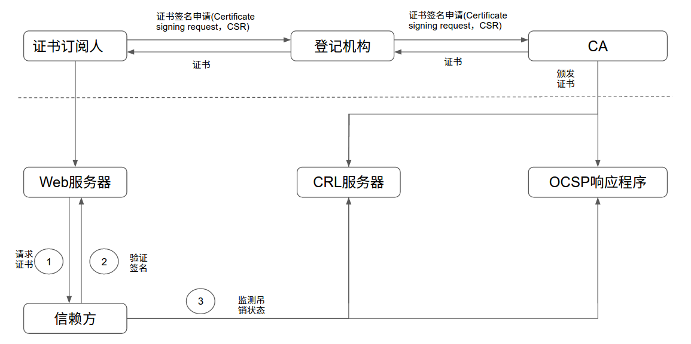
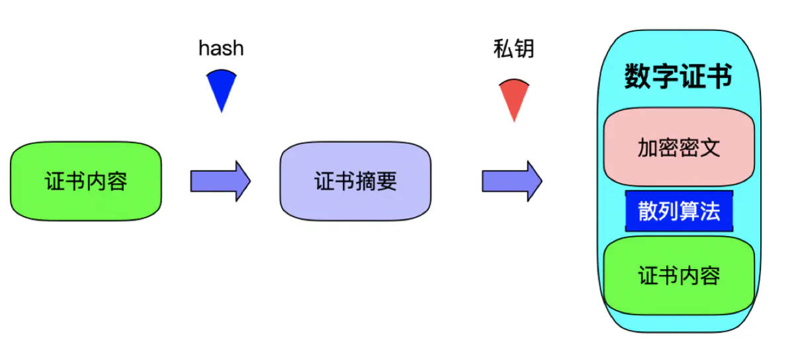

# 你了解对称加密，非对称加密，CA证书吗？

[[toc]]

我们都知道`HTTPS`应用层传输协议，`HTTPS = HTTP + TLS/SSL`，实际上`TLS/SSL`涉及到证书机构（CA）、证书、数字签名、私钥、公钥、对称加密、非对称加密等等一系列东西。

接下来我们看看如何把他们串起来

## 对称加密

### 定义

需要对加密和解密使用**相同[密钥](https://baike.baidu.com/item/密钥)**的[加密算法](https://baike.baidu.com/item/加密算法)。

由于其速度快，对称性加密通常在消息发送方需要加密大量数据时使用。对称性加密也称为[密钥加密](https://baike.baidu.com/item/密钥加密)。

所谓对称，就是采用这种加密方法的双方使用方式用同样的[密钥](https://baike.baidu.com/item/密钥)进行加密和解密。[密钥](https://baike.baidu.com/item/密钥)是控制加密及解密过程的指令。算法是一组规则，规定如何进行加密和解密。

因此加密的安全性不仅取决于加密算法本身，密钥管理的安全性更是重要。因为加密和解密都使用同一个密钥，如何把密钥安全地传递到解密者手上就成了必须要解决的问题。

### 优缺点

对称加密算法的优点是算法公开、计算量小、加密速度快、加密效率高。

对称加密算法的缺点：

- 在数据传送前，发送方和接收方必须商定好秘钥，然后使双方都能保存好秘钥。
- 如果一方的秘钥被泄露，那么加密信息也就不安全了。
- 每一对用户每次使用对称加密算法时，都需要使用其他人不知道的独一秘钥，这会使得收、发双方所拥有的钥匙数量巨大，密钥管理成为双方的负担。

## 非对称加密

### 定义

与[对称加密算法](https://baike.baidu.com/item/对称加密算法/211953)不同，[非对称加密算法](https://baike.baidu.com/item/非对称加密算法)需要两个[密钥](https://baike.baidu.com/item/密钥)：[公开密钥](https://baike.baidu.com/item/公开密钥)（publickey）和私有密钥（privatekey）。

[公开密钥](https://baike.baidu.com/item/公开密钥)与私有密钥是一对

- 如果用公开密钥对数据进行加密，只有用对应的私有密钥才能解密；
- 如果用私有密钥对数据进行加密，那么只有用对应的公开密钥才能解密。

因为加密和解密使用的是两个不同的[密钥](https://baike.baidu.com/item/密钥)，所以这种算法叫作[非对称加密算法](https://baike.baidu.com/item/非对称加密算法)。

### 优缺点

公钥密码体制采用的加密密钥(公开钥)和解密密钥(秘密钥)是不同的。由于加密密钥是公开的，密钥的分配和管理就很简单，而且能够很容易地实现数字签名，因此最适合于电子商务应用的需要。其主要的优点是：

(1)[密钥](https://baike.baidu.com/item/密钥/101144)分配简单。

(2)密钥的保存量少。

(3)可以满足互不相识的人之间进行私人谈话时的保密性要求。

(4)可以完成数字签名和数字鉴别。

但在实际应用中，公钥密码体制并没有完全取代私钥密码体制，这是因为公钥密码体制在应用中存在以下几个缺点：

(1)公钥密码是对大数进行操作，计算量特别浩大，速度远比不上私钥密码体制。

(2)公钥密码中要将相当一部分密码信息予以公布，势必对系统产生影响。

(3)在公钥密码中，若公钥文件被更改，则公钥被攻破。

## 应用

好了，到此你就已经了解对称加密和非对称加密的基本概念了

实际上，我们在使用**HTTPS**传输数据的时候就会用到**对称加密**，但是对称加密有个前提，就是双方能够持有相同的密钥

问题来了，比如服务端现在想要用对称加密，它有两把密钥，一把自己保存，一把要想办法**安全地**发送给客户端，这个时候就需要用到**非对称加密**来把这把密钥传送到对方

我们知道，非对称加密有私钥和公钥，假设服务端用**私钥**加密**密钥**(对称加密的密钥)，则客户端需要用**服务端发送的公钥**解密，但是服务端发送公钥的过程不一定是安全的，它可能被人劫持盗用，导致客户端无法拿到真正的公钥

举个例子：

- 服务端发送公钥的时候，被中间人劫持了
- 中间人拿到公钥，然后解密取出密钥（对称加密的密钥），中间人用**自己的私钥**加密了**密钥**（对称加密的密钥），同时把**自己的公钥**发送给客户端
- 客户端以为是合法服务端，就照常解密拿出**密钥**（对称加密的密钥），然后用该密钥加密要传输的数据
- 中间人拿到该加密的数据后，就可以通过之前拿到的密钥进行解密拿到数据，甚至可以篡改数据后加密传输给服务端
- 服务端以为是合法客户端，就照常进行自己的操作
- 整个过程中间人是透明的，但信息泄露和篡改双方都不知道，非常危险

到此，问题就变成了如何解决公钥的信任问题？也就是说如何让客户端拿到真正的公钥？

## CA证书

为了防止上面那种情况，数字证书就出现了，它其实就是基于上面所说的**非对称加密**（私钥加密数据，公钥解密）来验证其身份。

数字证书是由权威的CA（Certificate Authority）机构给**服务端**进行颁发，CA机构通过**服务端提供的相关信息**生成证书，证书内容包含了**持有人的相关信息，服务器的公钥，签署者签名信息（数字签名）**等，最重要的是**公钥在数字证书中**。

互联网PKI证书体系的结构如下图：

### 问题：数字证书是如何保证公钥来自请求的服务器(合法的服务端)呢？

数字证书上由**持有人的相关信息**，通过这点可以确定其不是一个中间人；但是证书也是可以伪造的，也就是说持有人的信息也可能是假的

### 问题：如何保证证书为真呢？

 一个证书中含有三个部分:"证书内容，散列算法，加密密文"，证书内容会被散列算法hash计算出hash值，然后使用CA机构提供的私钥进行RSA加密。

当客户端发起请求时，服务器将该数字证书发送给客户端，客户端通过CA机构提供的**公钥**对加密密文进行解密获得散列值（**数字签名**），同时将证书内容使用相同的散列算法进行Hash得到另一个散列值，比对两个散列值，如果两者相等则说明证书没问题。

## 应用

了解了CA认证，我们捋一捋如何让客户端拿到服务端真正的公钥

服务端在发送公钥之前，会先到CA认证机构申请数字证书，CA机构已经用私钥加密数字证书并返回给服务端，该证书包含了服务端的信息，**公钥**以及签名，然后服务端会将**数字证书**发送给客户端

这个时候我们假设中间人也获取到了数字证书（数字证书是公开的，可以下载），我们知道，数字证书是很难伪造的，因为一旦证书内容改变，通过散列算法得到hash值就会不同，客户端轻易就能判断出这是个假证书，因此中间人攻击就无效了

客户端拿到数字证书会进行验证，包括：

- 证书是否过期;
- 发行服务器证书的CA是否可靠;(通过查询浏览器或本机内的CA证书)
- 返回的公钥是否能正确解开返回证书中的数字签名;（通过使用本机或浏览器内置的CA公钥进行解密）
- 服务器证书上的域名是否和服务器的实际域名相匹配;
- 验证通过后，将继续进行通信，否则，终止通信;

## 参考

> [非对称加密与CA证书](https://www.orchome.com/1224)
>
> [一文看懂HTTPS、证书机构（CA）、证书、数字签名、私钥、公钥](https://www.jianshu.com/p/29e0ba31fb8d)
>
> [对称加密](https://baike.baidu.com/item/%E5%AF%B9%E7%A7%B0%E5%8A%A0%E5%AF%86)
>
> [非对称加密](https://baike.baidu.com/item/%E9%9D%9E%E5%AF%B9%E7%A7%B0%E5%8A%A0%E5%AF%86)

