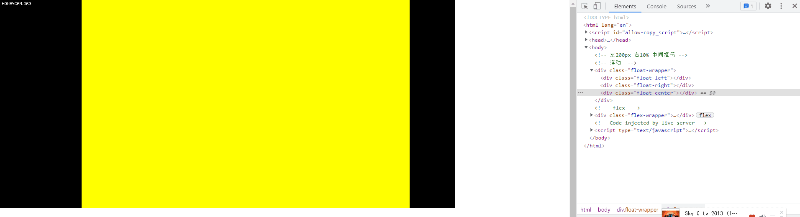

# 你对这些布局能信手拈来吗？

## 表单复杂布局

如果要你用CSS框架(ElementUI、Ant Design Vue等等)实现以下效果，你会怎么实现？


```vue
<!-- 代码有缩减，目的是看懂 -->
<template>
	<!-- 第一行普通布局 -->
    <a-form-model
      layout="horizontal"
      :label-col="{ span: 4 }"
      :wrapper-col="{ span: 10 }"
    >
      <a-form-model-item label="表描述" prop="tableDesc"></a-form-model-item>
        
	<!-- 第二行内嵌其它表单布局 -->
      <a-form-model-item
        :label-col="{ span: 4 }"
        :wrapper-col="{ span: 18 }"
        label="业务及层级"
      >
        <a-row :gutter="10">
          <a-col :span="6">
            <a-form-model-item prop="businessId"></a-form-model-item>
          </a-col>
          <a-col :span="18">
            <a-form-model-item prop="level"></a-form-model-item>
          </a-col>
        </a-row>
      </a-form-model-item>
        
	<!-- 第三行内嵌二级表单布局 -->
      <a-form-model-item label="主题域&amp;主题">
        <a-row :gutter="10">
          <a-col :span="12">
            <a-form-model-item prop="primaryClassId" required></a-form-model-item>
          </a-col>
          <a-col :span="12">
            <a-form-model-item prop="secondaryClassId" required></a-form-model-item>
          </a-col>
        </a-row>
      </a-form-model-item>
        
	<!-- 第四行同行两个同类型表单布局 -->
      <a-row :gutter="5">
        <a-col :span="8">
          <a-form-model-item
            label="业务负责人"
            prop="bizPrincipal"
            :label-col="{ span: 12 }"
            :wrapper-col="{ span: 10 }"
          ></a-form-model-item>
        </a-col>
        <a-col :span="8">
          <a-form-model-item
            label="技术负责人"
            prop="techPrincipal"
            :label-col="{ span: 8 }"
            :wrapper-col="{ span: 10 }"
            required
          ></a-form-model-item>
        </a-col>
      </a-row>
    </a-form-model>
</template>
```

这里面的重点是要理解`a-form-model-item`的作用：它实际上起到布局和校验的作用，这里我们只考虑布局

实现第三行布局时（一个标签，两个联动选择框），我们可以用一个只带`label`属性的`a-form-model-item`去跟上面的表单布局适应，里面实际的渲染空间只有`wrapper-col`的大小，在里面再使用一个`a-row`来进行栅格布局就可以轻松达到每个输入框各占50%

实现第四行布局时（两个标签，两个选择框），有两种写法

1. 第一种类似第三行的布局
2. 第二种直接用栅格布局，但是要注意两个`a-col`加起来要等于`label-col`+`wrapper-col`的大小（如果`a-row`加了`gutter`,则两个`a-col`加起来要略大于`label-col`+`wrapper-col`的大小），之后在里面再使用`a-form-model-item`的`label-col`和`wrapper-col`进行适当调整

---


## 网格自适应响应布局


```html
<style>
    /* content是外面的大盒子 */
    .content {
        display: grid;
        grid-gap: 10px;/* 网格间距 */
        grid-template-columns: repeat(auto-fit, minmax(200px, 1fr));/* 关键代码 */
        grid-template-rows: auto;
    }
</style>
```

解释一下关键代码`grid-template-columns: repeat(auto-fit, minmax(200px, 1fr));`

`grid-template-columns`是设置网格列宽的

`repeat`是一个函数，结合`auto-fit`使用的话，表明每个列都是自适应的

`minmax(200px,1fr)`表示列最小宽度是200px，`1fr`表示每列最大宽度自动分配等额剩余空间 

---

## 左固定，右10%，中间自适应


### float实现
```html
<style>
    body {
        margin: 0;
        padding: 0;
    }

    /* 浮动 */
    .float-wrapper {
        width: 100%;
        height: 500px;
    }
    
    .float-left {
        float: left;
        width: 200px;
        height: 100%;
        background-color: #000;
    }
    
    .float-right {
        float: right;
        width: 10%;
        height: 100%;
        background-color: #000;
    }
    
    .float-center {
        margin: 0 10% 0 200px;
        height: 100%;
        background-color: yellow;
    }
</style>

<body>
    <!-- 左200px 右10% 中间撑满 -->
    <!-- 浮动  -->
    <div class="float-wrapper">
        <div class="float-left"></div>
        <div class="float-right"></div>
        <div class="float-center"></div>
    </div>
</body>
```
### flex实现
```html

<style>
    body {
        margin: 0;
        padding: 0;
    }

    /* flex */
    .flex-wrapper {
        margin-top: 40px;
        width: 100%;
        display: flex;
        justify-content: center;
        align-items: center;
        height: 500px;
        border: 1px solid #000;
    }

    .flex-left {
        width: 200px;
        background-color: green;
        height: 100%;
    }

    .flex-center {
        flex: 1;
        background-color: yellow;
        height: 100%;
    }

    .flex-right {
        width: 10%;
        background-color: red;
        height: 100%;
    }
</style>

<body>
    <!-- 左200px 右10% 中间撑满 -->
    <!-- 浮动  -->
    <div class="flex-wrapper">
        <div class="flex-left"></div>
        <div class="flex-right"></div>
        <div class="flex-center"></div>
    </div>
</body>
```
### grid实现
```html
<style>
    body {
        margin: 0;
        padding: 0;
    }

    /* grid */
    .grid-wrapper {
        margin-top: 40px;
        width: 100%;
        height: 500px;
        display: grid;
        grid-template-columns: 200px 1fr 10%;
    }

    .grid-left {
        background-color: green;
        height: 100%;
    }

    .grid-center {
        background-color: yellow;
        height: 100%;
    }

    .grid-right {
        background-color: red;
        height: 100%;
    }
</style>

<body>
    <!-- 左200px 右10% 中间撑满 -->
     <!-- grid -->
    <div class="grid-wrapper">
        <div class="grid-left"></div>
        <div class="grid-center"></div>
        <div class="grid-right"></div>
    </div>
</body>
```


