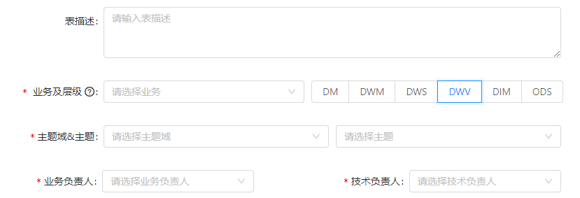
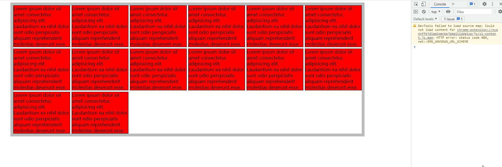

# 你对这些布局能信手拈来吗？

## 表单复杂布局

如果要你用CSS框架(ElementUI、Ant Design Vue等等)实现以下效果，你会怎么实现？



```vue
<template>
    <a-form-model
      ref="ruleForm"
      :model="form"
      :rules="rules"
      layout="horizontal"
      :label-col="{ span: 4 }"
      :wrapper-col="{ span: 10 }"
    >
      <a-form-model-item label="表描述" prop="tableDesc">
        <a-input
            v-model="form.tableDesc"
            placeholder="请输入表描述"
            type="textarea"
            rows="3"
        />
      </a-form-model-item>

      <a-form-model-item
        style="margin-bottom: 0"
        required
        :label-col="{ span: 4 }"
        :wrapper-col="{ span: 18 }"
      >
        <span slot="label">
          业务及层级
          <a-tooltip title="查看数仓模型规范">
            <a-icon
              type="question-circle-o"
            />
          </a-tooltip>
        </span>
        <a-row :gutter="10">
          <a-col :span="6">
            <a-form-model-item prop="businessId">
            <a-select
                v-model="form.businessId"
                placeholder="请选择业务"
                style="width: 100%; margin-right: 10px"
            >
                <a-select-option
                    v-for="business in [1,2,3]"
                    :key="business"
                    :value="business"
                >
                {{ business }}
                </a-select-option>
            </a-select>
            </a-form-model-item>
          </a-col>
          <a-col :span="18">
            <a-form-model-item prop="level">
              <a-radio-group
                v-model="form.level"
              >
                <a-radio-button
                  v-for="level in [1,2,3]"
                  :key="level"
                  :value="level"
                >
                  {{ level }}
                </a-radio-button>
              </a-radio-group>
            </a-form-model-item>
          </a-col>
        </a-row>
      </a-form-model-item>

      <a-form-model-item
        style="margin-bottom: 0"
        label="主题域&amp;主题"
        required
      >
        <a-row :gutter="10">
          <a-col :span="12">
            <a-form-model-item prop="primaryClassId" required>
                <a-select
                    v-model="form.primaryClassId"
                    placeholder="请选择主题域"
                >
                    <a-select-option
                    v-for="domain in [1,2,3]"
                    :key="domain"
                    :value="domain"
                    >
                    {{ domain }}
                    </a-select-option>
                </a-select>
            </a-form-model-item>
          </a-col>
          <a-col :span="12">
            <a-form-model-item prop="secondaryClassId" required>
                <a-select
                  v-model="form.secondaryClassId"
                  placeholder="请选择主题"
                >
                  <a-select-option
                    v-for="topic in [1,2,3]"
                    :key="topic"
                    :value="topic"
                  >
                    {{ topic }}
                  </a-select-option>
                </a-select>
            </a-form-model-item>
          </a-col>
        </a-row>
      </a-form-model-item>

      <a-row :gutter="5">
        <a-col :span="8">
          <a-form-model-item
            label="业务负责人"
            prop="bizPrincipal"
            :label-col="{ span: 12 }"
            :wrapper-col="{ span: 10 }"
            required
          >
            <a-select
                v-model="form.bizPrincipal"
                placeholder="请选择业务负责人"
                >
                <a-select-option
                    v-for="topic in [1,2,3]"
                    :key="topic"
                    :value="topic"
                >
                    {{ topic }}
                </a-select-option>
            </a-select>
          </a-form-model-item>
        </a-col>
        <a-col :span="8">
          <a-form-model-item
            label="技术负责人"
            prop="techPrincipal"
            :label-col="{ span: 8 }"
            :wrapper-col="{ span: 10 }"
            required
          >
            <a-select
                v-model="form.techPrincipal"
                placeholder="请选择技术负责人"
                >
                <a-select-option
                    v-for="topic in [1,2,3]"
                    :key="topic"
                    :value="topic"
                >
                    {{ topic }}
                </a-select-option>
            </a-select>
          </a-form-model-item>
        </a-col>
      </a-row>
    </a-form-model>
</template>
```

这里面的重点是要理解`a-form-model-item`的作用：它实际上起到布局和校验的作用，这里我们只考虑布局

实现第三行布局时（一个标签，两个联动选择框），我们可以用一个只带`label`属性的`a-form-model-item`去跟上面的表单布局适应，里面实际的渲染空间只有`wrapper-col`的大小，在里面再使用一个`a-row`来进行栅格布局就可以轻松达到每个输入框各占50%

实现第四行布局时（两个标签，两个选择框），有两种写法

1. 第一种类似第三行的布局
2. 第二种直接用栅格布局，但是要注意两个`a-col`加起来要等于`label-col`+`wrapper-col`的大小（如果`a-row`加了`gutter`,则两个`a-col`加起来要略大于`label-col`+`wrapper-col`的大小），之后在里面再使用`a-form-model-item`的`label-col`和`wrapper-col`进行适当调整


## 网格自适应响应布局



