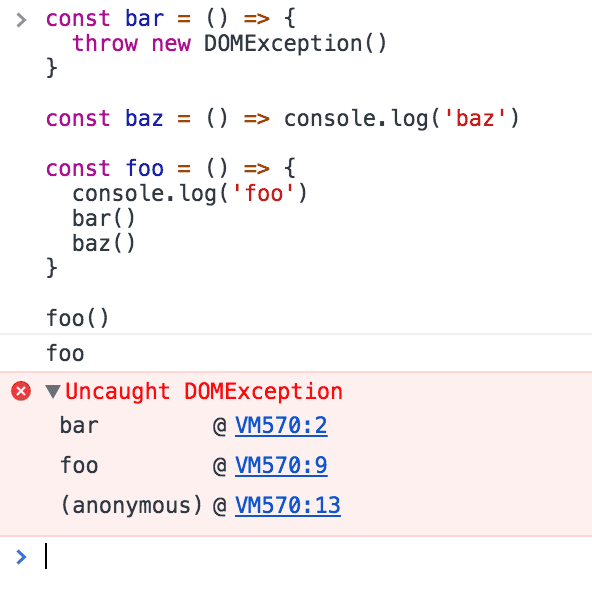
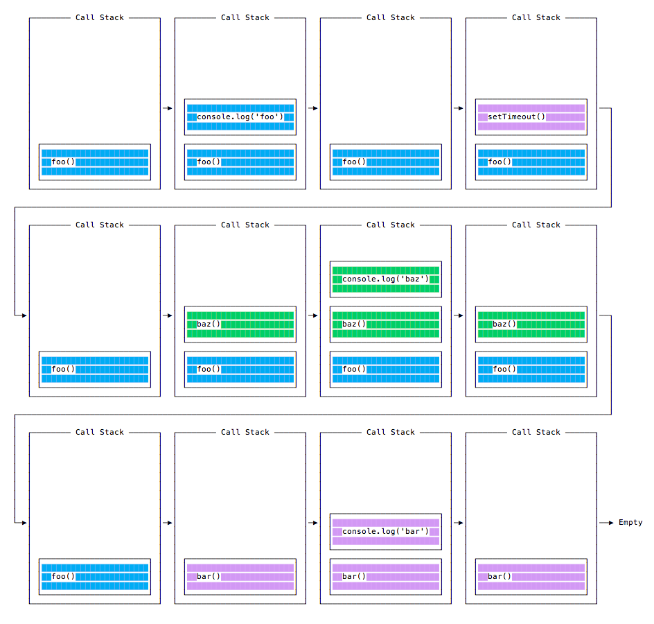
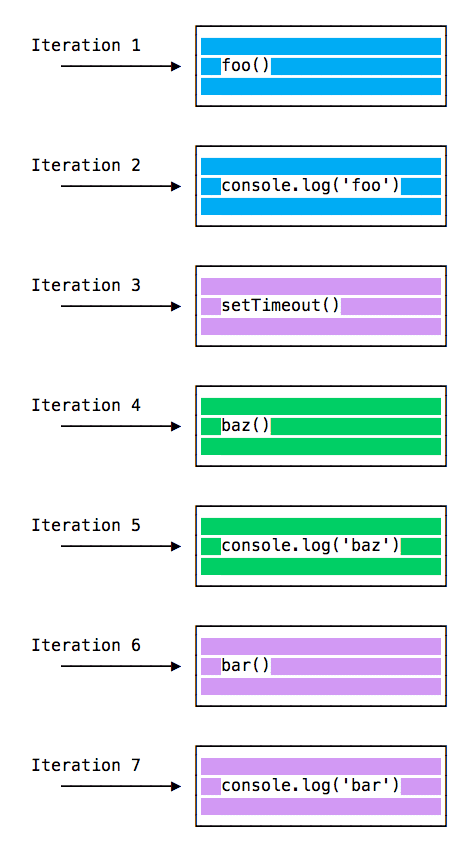
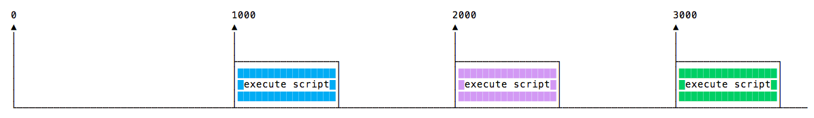
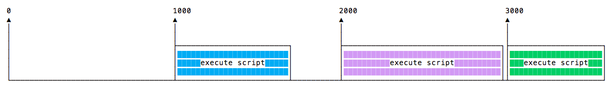
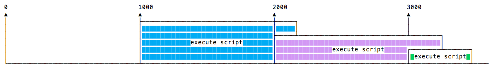
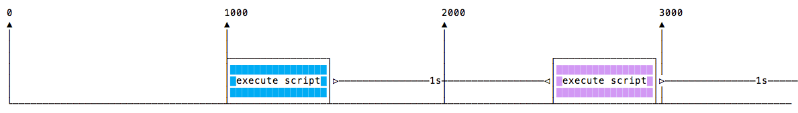

# 你只知道浏览器的事件循环？

[[toc]]


## 调用堆栈

调用堆栈是一个 LIFO 队列（后进先出）。

事件循环不断地检查调用堆栈，以查看是否需要运行任何函数。

当执行时，它会将找到的所有函数调用添加到调用堆栈中，并按顺序执行每个函数。

你知道在调试器或浏览器控制台中可能熟悉的错误堆栈跟踪吗？ 浏览器在调用堆栈中查找函数名称，以告知你是哪个函数发起了当前的调用：



## 一个简单的事件循环的阐释

举个例子：

```javascript
const bar = () => console.log('bar')

const baz = () => console.log('baz')

const foo = () => {
  console.log('foo')
  bar()
  baz()
}

foo()
```

此代码会如预期地打印：

```txt
foo
bar
baz
```

当运行此代码时，会首先调用 `foo()`。 在 `foo()` 内部，会首先调用 `bar()`，然后调用 `baz()`。

此时，调用堆栈如下所示：


每次迭代中的事件循环都会查看调用堆栈中是否有东西并执行它直到调用堆栈为空：


## 入队函数执行

上面的示例看起来很正常，没有什么特别的：JavaScript 查找要执行的东西，并按顺序运行它们。

让我们看看如何将函数推迟直到堆栈被清空。

`setTimeout(() => {}, 0)` 的用例是调用一个函数，但是是在代码中的每个其他函数已被执行之后。

举个例子：

```javascript
const bar = () => console.log('bar')

const baz = () => console.log('baz')

const foo = () => {
  console.log('foo')
  setTimeout(bar, 0)
  baz()
}

foo()
```

该代码会打印：

```bash
foo
baz
bar
```

当运行此代码时，会首先调用 foo()。 在 foo() 内部，会首先调用 setTimeout，将 `bar` 作为参数传入，并传入 0 作为定时器指示它尽快运行。 然后调用 baz()。

此时，调用堆栈如下所示：



这是程序中所有函数的执行顺序：



为什么会这样呢？

## 消息队列

当调用 setTimeout() 时，浏览器或 Node.js 会启动定时器。 当定时器到期时（在此示例中会立即到期，因为将超时值设为 0），则回调函数会被放入“消息队列”中。

在消息队列中，用户触发的事件（如单击或键盘事件、或获取响应）也会在此排队，然后代码才有机会对其作出反应。 类似 `onLoad` 这样的 DOM 事件也如此。

事件循环会赋予调用堆栈优先级，它首先处理在调用堆栈中找到的所有东西，一旦其中没有任何东西，便开始处理消息队列中的东西。

我们不必等待诸如 `setTimeout`、fetch、或其他的函数来完成它们自身的工作，因为它们是由浏览器提供的，并且位于它们自身的线程中。 例如，如果将 `setTimeout` 的超时设置为 2 秒，但不必等待 2 秒，等待发生在其他地方。

## ES6作业队列

ECMAScript 2015 引入了作业队列的概念，Promise 使用了该队列（也在 ES6/ES2015 中引入）。 这种方式会尽快地执行异步函数的结果，而不是放在调用堆栈的末尾。

在当前函数结束之前 resolve 的 Promise 会在当前函数之后被立即执行。

有个游乐园中过山车的比喻很好：消息队列将你排在队列的后面（在所有其他人的后面），你不得不等待你的回合，而工作队列则是快速通道票，这样你就可以在完成上一次乘车后立即乘坐另一趟车。

示例：

```javascript
const bar = () => console.log('bar')

const baz = () => console.log('baz')

const foo = () => {
  console.log('foo')
  setTimeout(bar, 0)
  new Promise((resolve, reject) =>
    resolve('应该在 baz 之后、bar 之前')
  ).then(resolve => console.log(resolve))
  baz()
}

foo()
```

这会打印：

```txt
foo
baz
应该在 baz 之后、bar 之前
bar
```

这是 Promise（以及基于 promise 构建的 async/await）与通过 `setTimeout()` 或其他平台 API 的普通的旧异步函数之间的巨大区别。

## process.nextTick()

当尝试了解 Node.js 事件循环时，其中一个重要的部分就是 `process.nextTick()`。

每当事件循环进行一次完整的行程时，我们都将其称为一个滴答。

当将一个函数传给 `process.nextTick()` 时，则指示引擎在当前操作结束（在下一个事件循环滴答开始之前）时调用此函数：

```javascript
process.nextTick(() => {
  //做些事情
})
```

事件循环正在忙于处理当前的函数代码。

当该操作结束时，JS 引擎会运行在该操作期间传给 `nextTick` 调用的所有函数。

这是可以告诉 JS 引擎异步地（在当前函数之后）处理函数的方式，但是尽快执行而不是将其排入队列。

调用 `setTimeout(() => {}, 0)` 会在下一个滴答结束时执行该函数，比使用 `nextTick()`（其会优先执行该调用并在下一个滴答开始之前执行该函数）晚得多。

当要确保在下一个事件循环迭代中代码已被执行，则使用 `nextTick()`。

## setImmediate()

当要异步地（但要尽可能快）执行某些代码时，其中一个选择是使用 Node.js 提供的 `setImmediate()` 函数：

```javascript
setImmediate(() => {
  //运行一些东西
})
```

作为 setImmediate() 参数传入的任何函数都是在事件循环的下一个迭代中执行的回调。

`setImmediate()` 与 `setTimeout(() => {}, 0)`（传入 0 毫秒的超时）、`process.nextTick()` 有何不同？

传给 `process.nextTick()` 的函数会在事件循环的当前迭代中（当前操作结束之后）被执行。 这意味着它会始终在 `setTimeout` 和 `setImmediate` 之前执行。

延迟 0 毫秒的 `setTimeout()` 回调与 `setImmediate()` 非常相似。 执行顺序取决于各种因素，但是它们都会在事件循环的下一个迭代中运行。

## JavaScript 定时器

## `setTimeout()`

当编写 JavaScript 代码时，可能希望延迟函数的执行。

这就是 setTimeout 的工作。 指定一个回调函数以供稍后执行，并指定希望它稍后运行的时间（以毫秒为单位）的值：

```javascript
setTimeout(() => {
  // 2 秒之后运行
}, 2000)

setTimeout(() => {
  // 50 毫秒之后运行
}, 50)
```

该语法定义了一个新的函数。 可以在其中调用所需的任何其他函数，也可以传入现有的函数名称和一组参数：

```javascript
const myFunction = (firstParam, secondParam) => {
  // 做些事情
}

// 2 秒之后运行
setTimeout(myFunction, 2000, firstParam, secondParam)
```

`setTimeout` 会返回定时器的 id。 通常不使用它，但是可以保存此 id，并在要删除此安排的函数执行时清除它：

```javascript
const id = setTimeout(() => {
  // 应该在 2 秒之后运行
}, 2000)

// 改变主意了
clearTimeout(id)
```

### 零延迟

如果将超时延迟指定为 `0`，则回调函数会被尽快执行（但是是在当前函数执行之后）：

```javascript
setTimeout(() => {
  console.log('后者 ')
}, 0)

console.log(' 前者 ')
```

会打印 `前者 后者`。

通过在调度程序中排队函数，可以避免在执行繁重的任务时阻塞 CPU，并在执行繁重的计算时执行其他函数。

> 某些浏览器（IE 和 Edge）实现的 `setImmediate()` 方法具有相同的确切功能，但是不是标准的，并且[在其他浏览器上不可用](https://caniuse.com/#feat=setimmediate)。但是在 Node.js 中它是标准的函数。

## `setInterval()`

`setInterval` 是一个类似于 `setTimeout` 的函数，不同之处在于：它会在指定的特定时间间隔（以毫秒为单位）一直地运行回调函数，而不是只运行一次：

```javascript
setInterval(() => {
  // 每 2 秒运行一次
}, 2000)
```

上面的函数每隔 2 秒运行一次，除非使用 `clearInterval` 告诉它停止（传入 `setInterval` 返回的间隔定时器 id）：

```javascript
const id = setInterval(() => {
  // 每 2 秒运行一次
}, 2000)

clearInterval(id)
```

通常在 `setInterval` 回调函数中调用 `clearInterval`，以使其自行判断是否应该再次运行或停止。 例如，此代码会运行某些事情，除非 `App.somethingIWait` 具有值 `arrived`：

```javascript
const interval = setInterval(() => {
  if (App.somethingIWait === 'arrived') {
    clearInterval(interval)
    return
  }
  // 否则做些事情
}, 100)
```

## 递归的 setTimeout

`setInterval` 每 n 毫秒启动一个函数，而无需考虑函数何时完成执行。

如果一个函数总是花费相同的时间，那就没问题了：

[](http://nodejs.cn/static/fa9e9fec1aea517d98b47b11c5fec296/4d383/setinterval-ok.png)

函数可能需要不同的执行时间，这具体取决于网络条件，例如：



也许一个较长时间的执行会与下一次执行重叠：



为了避免这种情况，可以在回调函数完成时安排要被调用的递归的 setTimeout：

```javascript
const myFunction = () => {
  // 做些事情

  setTimeout(myFunction, 1000)
}

setTimeout(myFunction, 1000)
```

实现此方案：

](http://nodejs.cn/static/4bde07363650160e953f899734adc29e/1790f/recursive-settimeout.png)

`setTimeout` 和 `setInterval` 可通过[定时器模块](http://nodejs.cn/api/timers.html)在 Node.js 中使用。

Node.js 还提供 `setImmediate()`（相当于使用 `setTimeout(() => {}, 0)`），通常用于与 Node.js 事件循环配合使用。

## 参考
> [node 事件循环](http://nodejs.cn/learn/the-nodejs-event-loop)
>
> [process.nextTick()](http://nodejs.cn/learn/understanding-process-nexttick)
>
> [setImmediate()](http://nodejs.cn/learn/understanding-setimmediate)
>
> [JS定时器](http://nodejs.cn/learn/discover-javascript-timers)

