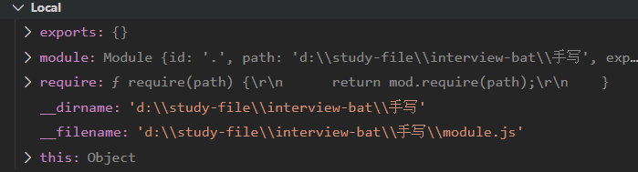
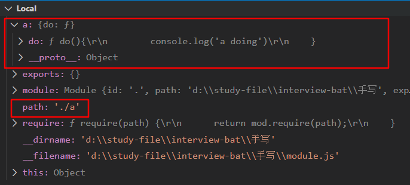
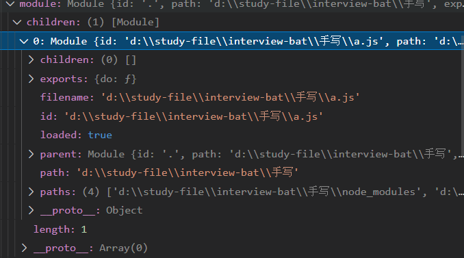
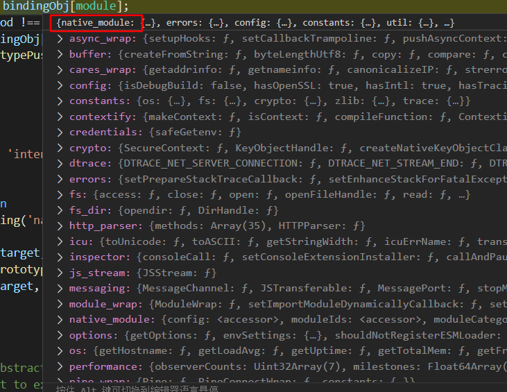

# node中的require会发生什么？

[[toc]]

## node环境中的JS文件结构

在node环境中，每个单独的js文件都自带了module变量，require函数等等



module它是Module类的实例，展开后是这样的，有个空的children数组等其它属性


导入当前目录的a.js文件

```js
const path = './a';
const a = require(path);
console.log("🚀 ~ file: module.js ~ line 45 ~ a", a)
```

Local多了a属性和path属性，path是我们定义的'./a'，a是加载进来的模块内容



此时我们展开module，发现module中的children数组有东西了，仔细一看，原来也是Module类的实例，里面存放的加载进来的a.js文件的相关信息，同样该实例也有一个空的children数组

原来：**模块化是树形结构那样存储的，每个js文件都是一个Module类，children数组存储了子模块，parent属性指向了当前模块的父模块**



## 第一次require发生了什么

以`const a = require('./a')`为例

### 1. 先来看一下源码

   ```js
   // Invoke with makeRequireFunction(module) where |module| is the Module object
   // to use as the context for the require() function.
   // Use redirects to set up a mapping from a policy and restrict dependencies
   // 翻译：当模块对象在上下文中使用require函数时，会触发makeRequireFunction函数，执行里面的require函数
   const urlToFileCache = new SafeMap();
   function makeRequireFunction(mod, redirects) {
     const Module = mod.constructor;
   
     let require;
     if (redirects) {
       //...
     } else {
      //调用这里的require   
       require = function require(path) {
         return mod.require(path);//这里的mod是父模块实例,从这里进入
       };
     }
   	//后面在_compile中再次调用makeRequireFunction(当前函数的时候)，会执行下面的内容
      function resolve(request, options) {
           validateString(request, 'request');
           return Module._resolveFilename(request, mod, false, options);
     }
   
     require.resolve = resolve;
   
     function paths(request) {
       validateString(request, 'request');
       return Module._resolveLookupPaths(request, mod);
     }
   
     resolve.paths = paths;
   
     require.main = process.mainModule;//根模块的信息
   
     // Enable support to add extra extension types.
     require.extensions = Module._extensions;
   
     require.cache = Module._cache;//磁盘文件路径缓存
   
     return require;
   }
   ```

### 2. 调用原型上的require函数，检验传入的id参数(即'./a')是否为String类型，调用Module类的`_load`函数

   ```js
   Module.prototype.require = function(id) {
     validateString(id, 'id');// 检验id是否为字符串，即'./a'
      //....略
     requireDepth++;
     try {
       return Module._load(id, this, /* isMain */ false);// 调用_load函数，id='./a',this=(当前上下文的)module父实例
     } finally {
       requireDepth--;
     }
   };
   ```

### 3. 执行`_load`函数，尝试查找文件路径缓存和module缓存，第一次查找不到，解析出文件路径 和 `new Module()`，然后分别缓存一下，再去调用module实例的load函数

   ```js
   Module._load = function(request, parent, isMain) {
     let relResolveCacheIdentifier;
     if (parent) {
      //...略
       relResolveCacheIdentifier = `${parent.path}\x00${request}`;//拼接缓存的key值=父文件路径+空格+请求路径
       const filename = relativeResolveCache[relResolveCacheIdentifier];//获取缓存文件名
       if (filename !== undefined) {//如果找到缓存(第一次自然是找不到啊)
         //...略
       }
     }
       //调用_resolveFilename函数解析文件路径(磁盘路径，例如'D:\\study-file\\interview-bat\\手写\\a.js')
     const filename = Module._resolveFilename(request, parent, isMain);
   	//通过filename去查找module缓存
     const cachedModule = Module._cache[filename];
     if (cachedModule !== undefined) {//如果找到缓存(第一次自然又是找不到啊)
       //...略
     }
   	//尝试加载原生模块(这里自然又是不符合)
     const mod = loadNativeModule(filename, request);
     if (mod && mod.canBeRequiredByUsers) return mod.exports;
   
     // Don't call updateChildren(), Module constructor already does.(意思是Module构造函数会调用updateChildren)
       //缓存都找不到，那只能new一个咯
     const module = cachedModule || new Module(filename, parent);
   /*
   看一下Module函数做了啥
   function Module(id = '', parent) {
     this.id = id;
     this.path = path.dirname(id);
     this.exports = {};
     this.parent = parent;
     updateChildren(parent, this, false);//这里调用了updateChildren，为啥嘞？
     this.filename = null;
     this.loaded = false;
     this.children = [];
   }
   */
       
     if (isMain) {//false,是否package.json里面的入口文件
       process.mainModule = module;
       module.id = '.';
     }
   
     Module._cache[filename] = module;//缓存一下当前模块
     if (parent !== undefined) {
       relativeResolveCache[relResolveCacheIdentifier] = filename;//缓存一下文件路径
     }
   
     let threw = true;
     try {
       // Intercept exceptions that occur during the first tick and rekey them
       // on error instance rather than module instance (which will immediately be
       // garbage collected).
       if (enableSourceMaps) {
         try {
           module.load(filename);
         } catch (err) {
           rekeySourceMap(Module._cache[filename], err);
           throw err; /* node-do-not-add-exception-line */
         }
       } else {
         module.load(filename);//调用module实例load函数
       }
       threw = false;
     } finally {
       if (threw) {
         delete Module._cache[filename];
         if (parent !== undefined) {
           delete relativeResolveCache[relResolveCacheIdentifier];
           const children = parent && parent.children;
           if (ArrayIsArray(children)) {
             const index = children.indexOf(module);
             if (index !== -1) {
               children.splice(index, 1);
             }
           }
         }
       } else if (module.exports &&
                  !isProxy(module.exports) &&
                  ObjectGetPrototypeOf(module.exports) ===
                    CircularRequirePrototypeWarningProxy) {
         ObjectSetPrototypeOf(module.exports, PublicObjectPrototype);
       }
     }
   
     return module.exports;
   };
   //回到第2步，require函数
   ```

### 4. load函数，通过Module._extensions对象(有[.js],[.json],[.node]三个函数)找到对应的后缀处理函数，将当前module实例和文件路径传进去

   ```js
   // Given a file name, pass it to the proper extension handler.(给一个文件路径，将它传递给正确的后缀处理函数)
   Module.prototype.load = function(filename) {
     debug('load %j for module %j', filename, this.id);
   
     assert(!this.loaded);
     this.filename = filename;
     this.paths = Module._nodeModulePaths(path.dirname(filename));
   
     const extension = findLongestRegisteredExtension(filename);
     // allow .mjs to be overridden
     if (filename.endsWith('.mjs') && !Module._extensions['.mjs']) {
       throw new ERR_REQUIRE_ESM(filename);
     }
     Module._extensions[extension](this, filename);//找到对应的后缀处理函数，将当前module实例和文件路径传进去
     //执行完上面的函数后，this.exports就有导出的内容了,this是子模块的module实例
     this.loaded = true;
   
     const ESMLoader = asyncESM.ESMLoader;
     // Create module entry at load time to snapshot exports correctly
     const exports = this.exports;
     // Preemptively cache
     if ((module?.module === undefined ||
          module.module.getStatus() < kEvaluated) &&
         !ESMLoader.cjsCache.has(this))
       ESMLoader.cjsCache.set(this, exports);
   };
   // 回到第3步，_load函数
   ```

### 5. 以解析js文件为例，先判断是否是node_modules里面的包，显然不是，再查找是否已经加载过该路径的资源，第一次显然找不到缓存，调用文件系统的同步读取函数，获取文件内容字符串，接下来调用module实例的`_compile`函数编译字符串

   ```js
   Module._extensions['.js'] = function(module, filename) {
     if (filename.endsWith('.js')) {
       const pkg = readPackageScope(filename);//依次遍历作用域链，判断是否是node_modules里面的包
       // Function require shouldn't be used in ES modules.
       if (pkg && pkg.data && pkg.data.type === 'module') {//显然不是
         const { parent } = module;
         const parentPath = parent && parent.filename;
         const packageJsonPath = path.resolve(pkg.path, 'package.json');
         throw new ERR_REQUIRE_ESM(filename, parentPath, packageJsonPath);
       }
     }
     // If already analyzed the source, then it will be cached.(如果已经解析了资源，那么会被缓存)
     const cached = cjsParseCache.get(module);
     let content;
     if (cached && cached.source) {//第一次显然不是
       content = cached.source;
       cached.source = undefined;
     } else {
       content = fs.readFileSync(filename, 'utf8');//同步读取文件(content为字符串)
     }
     module._compile(content, filename);//编译文件内容
   };
   ```

### 6. `_compile`执行完后，`module.exports`里面就有文件导出的内容了

   ```js
   // Run the file contents in the correct scope or sandbox. Expose
   // the correct helper variables (require, module, exports) to
   // the file.
   // Returns exception, if any.
   // 在正确的作用域内跑一次文件内容，将辅助函数(require,module,exports)暴露给文件
   Module.prototype._compile = function(content, filename) {
     let moduleURL;
     let redirects;
     if (policy?.manifest) {
       moduleURL = pathToFileURL(filename);
       redirects = policy.manifest.getDependencyMapper(moduleURL);
       policy.manifest.assertIntegrity(moduleURL, content);
     }
   
     maybeCacheSourceMap(filename, content, this);
     const compiledWrapper = wrapSafe(filename, content, this);
   
     let inspectorWrapper = null;
     if (getOptionValue('--inspect-brk') && process._eval == null) {
       if (!resolvedArgv) {
         // We enter the repl if we're not given a filename argument.
         if (process.argv[1]) {
           try {
             resolvedArgv = Module._resolveFilename(process.argv[1], null, false);
           } catch {
             // We only expect this codepath to be reached in the case of a
             // preloaded module (it will fail earlier with the main entry)
             assert(ArrayIsArray(getOptionValue('--require')));
           }
         } else {
           resolvedArgv = 'repl';
         }
       }
   
       // Set breakpoint on module start
       if (resolvedArgv && !hasPausedEntry && filename === resolvedArgv) {
         hasPausedEntry = true;
           //internalBinding(): 私有的内部c++绑定加载程序，用户无法访问，只能通过NativeModule.require() 获得，后面会讲
         inspectorWrapper = internalBinding('inspector').callAndPauseOnStart;
       }
     }
     const dirname = path.dirname(filename);
     const require = makeRequireFunction(this, redirects);// 这里调用的函数跟第一步所在的函数是一样的
     let result;
     const exports = this.exports;//{}
     const thisValue = exports;//{}
     const module = this;//父模块实例
     if (requireDepth === 0) statCache = new Map();
         if (inspectorWrapper) {
       result = inspectorWrapper(compiledWrapper, thisValue, exports,
                                 require, module, filename, dirname);
     } else {
       result = compiledWrapper.call(thisValue, exports, require, module,
                                     filename, dirname);//这里会重新回到require('./a'),重新执行之前的代码，再次执行到这里的时候，会进入a.js文件里面，遍历文件的所有内容(包括没有导出的)
     }
     hasLoadedAnyUserCJSModule = true;
     if (requireDepth === 0) statCache = null;
     return result;
   };
   //回到第4步，load函数
   ```

   

## internalBinding

 internalBinding(): 私有的内部c++绑定加载程序，用户无法访问，只能通过NativeModule.require() 获得

```js
// Set up internalBinding() in the closure.在闭包作用域中安装internalBinding函数
let internalBinding;
{
  const bindingObj = ObjectCreate(null);
  // eslint-disable-next-line no-global-assign
  internalBinding = function internalBinding(module) {
    let mod = bindingObj[module];//bindingObj是什么？
    if (typeof mod !== 'object') {
      mod = bindingObj[module] = getInternalBinding(module);
      ArrayPrototypePush(moduleLoadList, `Internal Binding ${module}`);
    }
    return mod;
  };
}
```

看一下截图，原来是一些原生的模块



## 疑问

用毒蛇的毒毒毒蛇毒蛇会被毒蛇的毒毒死吗？