# 这可不是我的笔记嗷

[[toc]]


## 运⾏环境

1. node 12.x
2. vue.js 2.6.x
3. vue-cli 4.x

## 组件化

vue组件系统提供了⼀种抽象，让我们可以使⽤独⽴可复⽤的组件来构建⼤型应⽤，任意类型的应⽤界
⾯都可以抽象为⼀个组件树。组件化能提⾼开发效率， ⽅便重复使⽤， 简化调试步骤， 提升项⽬可维护
性， 便于多⼈协同开发。

## 通信方式
组件通信常⽤⽅式

- props
- event
- vuex

- ⾃定义事件

- 边界情况
  - `$parent`
  - `$children`
  - `$root`
  - `$refs`
  - `provide/inject`
- ⾮prop特性
  - `$attrs`
  - `$​​​​listeners`

### props

⽗给⼦传值
```js
// child
props: { msg: String }

// parent
<HelloWorld msg="Welcome to Your Vue.js App"/>  
```
### ⾃定义事件

⼦给⽗传值

```vue
// child
this.$emit('add', good)
// parent
<Cart @add="cartAdd($event)"></Cart>
```

### 事件总线

任意两个组件之间传值常⽤事件总线 或 vuex的⽅式。

```js
// Bus：事件派发、监听和回调管理
class Bus {
    constructor(){
        this.callbacks = {}
    }
    $on(name, fn){
        this.callbacks[name] = this.callbacks[name] || []
        this.callbacks[name].push(fn)
    }
    $emit(name, args){
        if(this.callbacks[name]){
            this.callbacks[name].forEach(cb => cb(args))
        }
    }
}
// main.js
Vue.prototype.$bus = new Bus()
// child1
this.$bus.$on('foo', handle)
// child2
this.$bus.$emit('foo')
```

> 实践中通常⽤Vue代替Bus，因为Vue已经实现了相应接⼝

### vuex

创建唯⼀的全局数据管理者store，通过它管理数据并通知组件状态变更。

`$parent/$root`

兄弟组件之间通信可通过共同祖辈搭桥， `$parent`或`$root`。

```js
// brother1
this.$parent.$on('foo', handle)
// brother2
this.$parent.$emit('foo')
```

`$children`

⽗组件可以通过`$children`访问⼦组件实现⽗⼦通信。

```js
// parent
this.$children[0].xx = 'xxx'
```

> 注意：` $children`不能保证⼦元素顺序
> 和`$refs`有什么区别？// `$refs`获取单个，`$chilren`获取数组


`$attrs/$listeners`
包含了⽗作⽤域中**不作为 prop 被识别** (且获取) 的特性绑定 ( `class` 和 `style` 除外)。当⼀个组件没有声明任何 prop 时，这⾥会包含所有⽗作⽤域的绑定 ( `class` 和 `style` 除外)，并且可以通过` vbind="$attrs"` 传⼊内部组件——在创建⾼级别的组件时⾮常有⽤。

```js
// child：并未在props中声明foo
<p>{{$attrs.foo}}</p>
// parent
<HelloWorld foo="foo"/>
```

### refs

获取⼦节点引⽤

```js
// parent
<HelloWorld ref="hw"/>
mounted() {
    this.$refs.hw.xx = 'xxx'
}
```

### provide/inject

能够实现祖先和后代之间传值

```js
// ancestor
provide() {
    return {foo: 'foo'}
}
// descendant
inject: ['foo']
```

## 插槽
插槽语法是Vue 实现的内容分发 API，⽤于复合组件开发。该技术在通⽤组件库开发中有⼤量应⽤。

### 匿名插槽

```vue
// comp1
<div>
    <slot></slot>
</div>
// parent
<comp>hello</comp>
```

### 具名插槽
将内容分发到⼦组件指定位置

```vue
// comp2
<div>
    <slot></slot>
    <slot name="content"></slot>
</div>
// parent
<Comp2>
    <!-- 默认插槽⽤default做参数 -->
    <template v-slot:default>具名插槽</template>
    <!-- 具名插槽⽤插槽名做参数 -->
    <template v-slot:content>内容...</template>
</Comp2>
```

### 作⽤域插槽

分发内容要⽤到⼦组件中的数据

```vue
// comp3

<div>
    <slot :foo="foo"></slot>
</div>

// parent
<Comp3>
    <!-- 把v-slot的值指定为作⽤域上下⽂对象 -->

    <template v-slot:default="slotProps">
		来⾃⼦组件数据： {{slotProps.foo}}
    </template>

</Comp3>  
```

## vue-router3.x源码解析 

### 需求分析

- 作为⼀个插件存在：实现VueRouter类和install⽅法
- 实现两个全局组件： router-view⽤于显示匹配组件内容， router-link⽤于跳转
- 监控url变化：监听hashchange或popstate事件
- 响应最新url：创建⼀个响应式的属性current，当它改变时获取对应组件并显示

实现⼀个插件：创建VueRouter类和install⽅法  

### 创建vue-router.js  

```js
let Vue; // 引⽤构造函数， VueRouter中要使⽤
// 保存选项
class VueRouter {
    constructor(options) {
        this.$options = options;
    }
}
// 插件：实现install⽅法，注册$router
VueRouter.install = function(_Vue) {
    // 引⽤构造函数， VueRouter中要使⽤
    Vue = _Vue;
    // 任务1：挂载$router
    Vue.mixin({
        beforeCreate() {
            // 只有根组件拥有router选项
            if (this.$options.router) {
                // vm.$router
                Vue.prototype.$router = this.$options.router;
            }
        }
    });
    // 任务2：实现两个全局组件router-link和router-view
    Vue.component('router-link', Link)
    Vue.component('router-view', View)
};
export default VueRouter
```

为什么要⽤混⼊(mixin)⽅式写？

主要原因是use代码在前， Router实例创建在后，⽽install逻辑⼜需要⽤到该实例  

### 创建router-view和router-link
```js
// router-link.js
export default {
    props: {
        to: String,
        required: true
    },
    render(h) {
        // return <a href={'#'+this.to}>{this.$slots.default}</a>;
        return h('a', {
            attrs: {
                href: '#' + this.to
            }
        }, [
            this.$slots.default
        ])
    }
}
```
```js
// router-view.js
export default {
    render(h) {
        // 暂时先不渲染任何内容
        return h(null);
    }
}
```

### 监控url变化

定义响应式的current属性，监听hashchange事件
```js
// vue-router.js
class VueRouter {
    constructor(options) {
        // current应该是响应式的
        // Vue.util.defineReactive(this, 'current', '/')
        // 定义响应式的属性current
        const initial = window.location.hash.slice(1) || '/'
        Vue.util.defineReactive(this, 'current', initial)
        // 监听hashchange事件
        window.addEventListener('hashchange', this.onHashChange.bind(this))
        window.addEventListener('load', this.onHashChange.bind(this))
    }
    onHashChange() {
        this.current = window.location.hash.slice(1)
    }
}
```

动态获取对应组件

```js
// router-view.js  
export default {
    render(h) {
        // 动态获取对应组件
        let component = null;
        this.$router.$options.routes.forEach(route => {
            if (route.path === this.$router.current) {
                component = route.component
            }
        });
        return h(component);
    }
}
```

提前处理路由表避免每次都循环  

```js
//vue-router.js
class VueRouter {
    constructor(options) {
        // 缓存path和route映射关系
        this.routeMap = {}
        this.$options.routes.forEach(route => {
            this.routeMap[route.path] = route
        });
    }
}  
```

```js
// router-view.js
export default {
    render(h) {
        const {routeMap, current} = this.$router
        const component = routeMap[current] ? routeMap[current].component : null;
        return h(component);
    }
}
```

## vuex3.x源码解析

Vuex 集中式存储管理应⽤的所有组件的状态，并以相应的规则保证状态以可预测的⽅式发⽣变化  

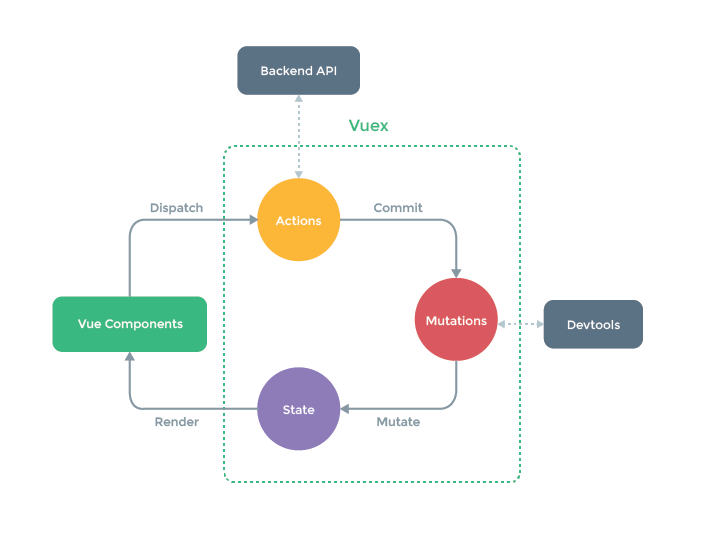

### 核⼼概念

- state 状态、数据
- mutations 更改状态的函数
- actions 异步操作
- store 包含以上概念的容器  

#### 状态 - state  

state保存应⽤状态  

```js
export default new Vuex.Store({
    state: { counter:0 },
})
```

#### 状态变更 - mutations  

mutations⽤于修改状态， store.js  

```js
export default new Vuex.Store({
    mutations: {
        add(state) {
            state.counter++
        }
    }
})
```

#### 派⽣状态 - getters  

从state派⽣出新状态，类似计算属性  

```js
export default new Vuex.Store({
    getters: {
        doubleCounter(state) { // 计算剩余数量
            return state.counter * 2;
        }
    }
})
```

#### 动作 - actions  

添加业务逻辑，类似于controller  

```js
export default new Vuex.Store({
    actions: {
        add({ commit }) {
            setTimeout(() => {
                commit('add')
            }, 1000);
        }
    }
})
```

测试代码 :

```vue
<p @click="$store.commit('add')">counter: {{$store.state.counter}}</p>
<p @click="$store.dispatch('add')">async counter: {{$store.state.counter}}</p>
<p>double： {{$store.getters.doubleCounter}}</p>
```

### 任务分析

- 实现⼀个插件：声明Store类，挂载$store
- Store具体实现：
  - 创建响应式的state，保存mutations、 actions和getters
  - 实现commit根据⽤户传⼊type执⾏对应mutation
  - 实现dispatch根据⽤户传⼊type执⾏对应action，同时传递上下⽂
  - 实现getters，按照getters定义对state做派⽣  

初始化： Store声明、 install实现

```js
//  vuex.js  
let Vue;
class Store {
    constructor(options = {}) {
        this._vm = new Vue({
            data: {
                $$state:options.state
            }
        });
    }
    get state() {
        return this._vm._data.$$state
    }
    set state(v) {
        console.error('please use replaceState to reset state');
    }
}
function install(_Vue) {
    Vue = _Vue;
    Vue.mixin({
        beforeCreate() {
            if (this.$options.store) {
                Vue.prototype.$store = this.$options.store;
            }
        }
    });
}
export default { Store, install }
```

实现commit：根据⽤户传⼊type获取并执⾏对应mutation  

```js
class Store {
    constructor(options = {}) {
        // 保存⽤户配置的mutations选项
        this._mutations = options.mutations || {}
    }
    commit(type, payload) {
        // 获取type对应的mutation
        const entry = this._mutations[type]
        if (!entry) {
            console.error(`unknown mutation type: ${type}`);
            return
        }
        // 指定上下⽂为Store实例
        // 传递state给mutation
        entry(this.state, payload);
    }
}
```

实现actions：根据⽤户传⼊type获取并执⾏对应action  

```js
class Store {
    constructor(options = {}) {
        // 保存⽤户编写的actions选项
        this._actions = options.actions || {}
        // 绑定commit上下⽂否则action中调⽤commit时可能出问题!!
        // 同时也把action绑了，因为action可以互调
        const store = this
        const {commit, action} = store
        this.commit = function boundCommit(type, payload) {
            commit.call(store, type, payload)
        }
        this.action = function boundAction(type, payload) {
            return action.call(store, type, payload)
        }
    }
    dispatch(type, payload) {
        // 获取⽤户编写的type对应的action
        const entry = this._actions[type]
        if (!entry) {
            console.error(`unknown action type: ${type}`);
            return
        }
        // 异步结果处理常常需要返回Promise
        return entry(this, payload);
    }
}
```

## vue2.x源码解析

### vue的设计思想

- MVVM模式

  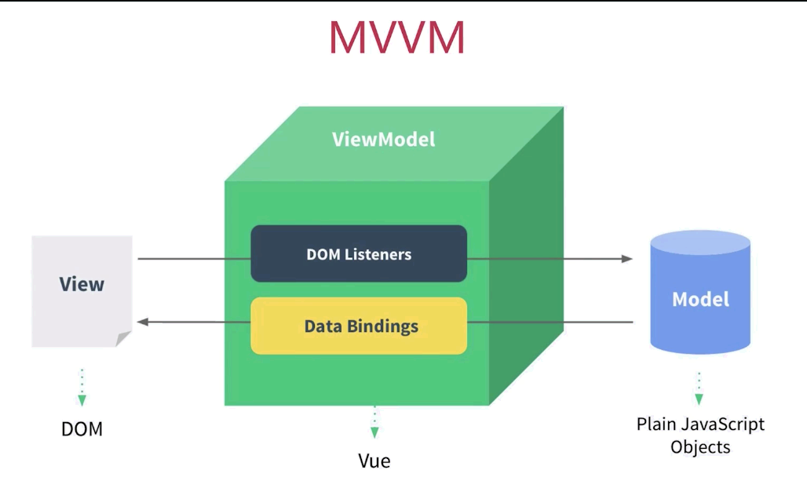

MVVM框架的三要素： **数据响应式**、**模板引擎**及其**渲染**  

数据响应式：监听数据变化并在视图中更新

- Object.defineProperty()
- Proxy

模版引擎：提供描述视图的模版语法

- 插值： {{}}
- 指令： v-bind， v-on， v-model， v-for， v-if

渲染：如何将模板转换为html

- 模板 => vdom => dom  

### 数据响应式原理  

数据变更能够响应在视图中，就是数据响应式。 vue2中利⽤ Object.defineProperty() 实现变更检
测  

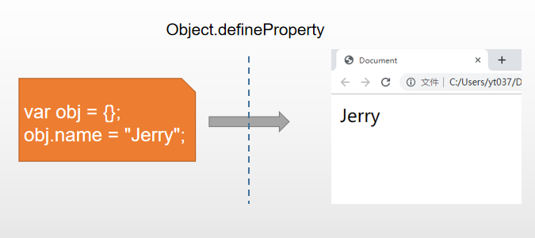

简单实现

```js
const obj = {}
function defineReactive(obj, key, val) {
    Object.defineProperty(obj, key, {
        get() {
            console.log(`get ${key}:${val}`);
            return val
        },
        set(newVal) {
            if (newVal !== val) {
                console.log(`set ${key}:${newVal}`);
                val = newVal
            }
        }
    })
}
defineReactive(obj, 'foo', 'foo')
obj.foo
obj.foo = 'foooooooooooo'
```

结合视图  

```html
<!DOCTYPE html>
<html lang="en">
    <head></head>
    <body>
        <div id="app"></div>
        <script>
            const obj = {}
            function defineReactive(obj, key, val) {
                Object.defineProperty(obj, key, {
                    get() {
                        console.log(`get ${key}:${val}`);
                        return val
                    },
                    set(newVal) {
                        if (newVal !== val) {
                            val = newVal
                            update()
                        }
                    }
                })
            }
            defineReactive(obj, 'foo', '')
            obj.foo = new Date().toLocaleTimeString()
            function update() {
                app.innerText = obj.foo
            }
            setInterval(() => {
                obj.foo = new Date().toLocaleTimeString()
            }, 1000);
        </script>
    </body>
</html>  
```

遍历需要响应化的对象  

```js
// 对象响应化：遍历每个key，定义getter、 setter
function observe(obj) {
    if (typeof obj !== 'object' || obj == null) {
        return
    }
    Object.keys(obj).forEach(key => {
        defineReactive(obj, key, obj[key])
    })
}
const obj = {foo:'foo',bar:'bar',baz:{a:1}}
observe(obj)
obj.foo
obj.foo = 'foooooooooooo'
obj.bar
obj.bar = 'barrrrrrrrrrr'
obj.baz.a = 10 // 嵌套对象no ok
```

解决嵌套对象问题  

```js
function defineReactive(obj, key, val) {
    // 递归处理
    observe(val)

    Object.defineProperty(obj, key, {
        get(){
            console.log('get', key);
            return val
        },
        set(newVal){
            if (newVal !== val) {
                console.log('set', key, newVal);
                observe(newVal)// 新值是对象的情况
                val = newVal
            }
        },
    })
}

function observe(obj) {
  if(typeof obj !== 'object' || obj == null) {
    return
  }

  Object.keys(obj).forEach(key => {
    defineReactive(obj, key, obj[key])
  })
}
```

如果添加/删除了新属性⽆法检测  

```js
function set(obj, key, val) {
    defineReactive(obj, key, val)
}
```

**defineProperty() 不⽀持数组**  

### 数据响应化  

```html
<--> vue.html </-->
<!DOCTYPE html>
<html lang="en">
    <head>
        <meta charset="UTF-8">
        <meta name="viewport" content="width=device-width, initial-scale=1.0">
        <meta http-equiv="X-UA-Compatible" content="ie=edge">
        <title>Document</title>
    </head>
    <body>
        <div id="app">
            <p>{{counter}}</p>
        </div>
        <script src="node_modules/vue/dist/vue.js"></script>
        <script>
            const app = new Vue({
                el:'#app',
                data: {
                    counter: 1
                },
            })
            setInterval(() => {
                app.counter++
            }, 1000);
        </script>
    </body>
</html>
```

### 原理分析  

1. new Vue() ⾸先执⾏初始化，对data执⾏响应化处理，这个过程发⽣在Observer中  

2. 同时对模板执⾏编译，找到其中动态绑定的数据，从data中获取并初始化视图，这个过程发⽣在Compile中
3. 同时定义⼀个更新函数和Watcher，将来对应数据变化时Watcher会调⽤更新函数
4. 由于data的某个key在⼀个视图中可能出现多次，所以每个key都需要⼀个管家Dep来管理多个Watcher
5. 将来data中数据⼀旦发⽣变化，会⾸先找到对应的Dep，通知所有Watcher执⾏更新函数  

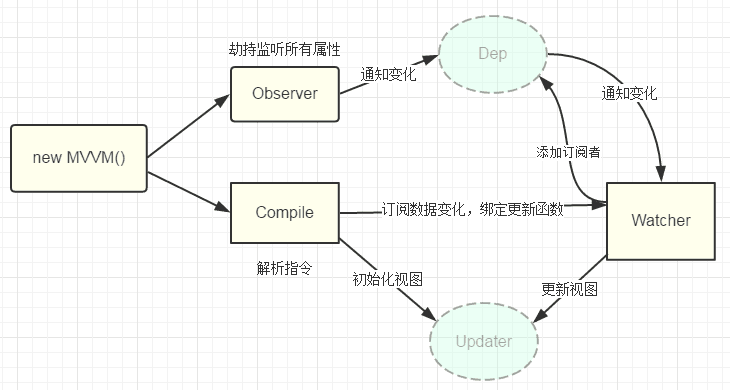

涉及类型介绍  

- Vue：框架构造函数
- Observer：执⾏数据响应化（分辨数据是对象还是数组）
- Compile：编译模板，初始化视图，收集依赖（更新函数、 watcher创建）
- Watcher：执⾏更新函数（更新dom）
- Dep：管理多个Watcher，批量更新  

#### Vue

```js
// vue.js
class Vue {
    constructor(options) {
        // 保存选项
        this.$options = options
        this.$data = options.data;

        // 响应化处理
        observe(this.$data)

        // 代理
        proxy(this)

        // 编译器
        new Compiler('#app', this)
    }
}
```
#### defineReactive

```js
// 数据响应式
function defineReactive(obj, key, val) {
    // 递归处理
    observe(val)

    // 创建一个Dep实例
    const dep = new Dep()

    Object.defineProperty(obj, key, {
        get() {
            console.log('get', key);

            // 依赖收集: 把watcher和dep关联
            // 希望Watcher实例化时，访问一下对应key，同时把这个实例设置到Dep.target上面
            Dep.target && dep.addDep(Dep.target)

            return val
        },
        set(newVal) {
            if (newVal !== val) {
                console.log('set', key, newVal);
                observe(newVal)
                val = newVal

                // 通知更新
                dep.notify()
            }
        },
    })
}
```
#### observe

```js
// 让我们使一个对象所有属性都被拦截
function observe(obj) {
    if (typeof obj !== 'object' || obj == null) {
        return
    }

    // 创建Observer实例:以后出现一个对象，就会有一个Observer实例
    new Observer(obj)

}
```
#### 代理访问

将`this.name`代理到`this.$data.name`

```js
// 代理data中数据
function proxy(vm) {
    Object.keys(vm.$data).forEach(key => {
        Object.defineProperty(vm, key, {
            get() {
                return vm.$data[key]
            },
            set(v) {
                vm.$data[key] = v
            }
        })
    })
}
```
#### 重写数组方法

```js
// 截取改变数组的方法
const originProto = Array.prototype;
const arrayProto = Object.create(originProto); //这样调用数组方法时候会顺着原型链先找到我们定义的arrayProto
['push', 'pop', 'shift', 'unshift'].forEach(method => {
    arrayProto[method] = function () {
        console.log('method:' + method);
        return Array.prototype[method].apply(this, arguments);
    };
})

```
#### Observer

做数据响应化

```js
class Observer {
    constructor(value) {
        this.value = value
        this.walk(value)
    }

    // 遍历对象做响应式
    walk(obj) {
        if (Array.isArray(obj)) {
            obj.__proto__ = arrayProto; //改变数组的原型，让其能找到我们定义的method
            for (const item of obj) {
                observe(item);
            }
        } else {
            Object.keys(obj).forEach(key => {
                defineReactive(obj, key, obj[key])
            })
        }
    }
}
```
#### Compiler

解析模板，找到依赖，并和前面拦截的属性关联起来

- 获取dom
  - 遍历子元素
    - 编译节点
      - 遍历属性
        - `v-`开头
          - v-text：处理textContent
          - v-html：处理innerHTML
          - v-model：监听input
        - `@`开头
          - 绑定click
    - 编译文本

```js
// new Compiler('#app', vm)
class Compiler {
    constructor(el, vm) {
        this.$vm = vm
        this.$el = document.querySelector(el)

        // 执行编译
        this.compile(this.$el)
    }

    compile(el) {
        // 遍历这个el
        el.childNodes.forEach(node => {
            // 是否是元素
            if (node.nodeType === 1) {
                // console.log('编译元素', node.nodeName)
                this.compileElement(node)
            } else if (this.isInter(node)) {
                // console.log('编译文本', node.textContent);
                this.compileText(node)
            }

            // 递归
            if (node.childNodes) {
                this.compile(node)
            }
        })

    }

    // 解析绑定表达式{{}}
    compileText(node) {
        // 获取正则匹配表达式，从vm里面拿出它的值
        // node.textContent = this.$vm[RegExp.$1]
        this.update(node, RegExp.$1, 'text')
    }

    // 编译元素
    compileElement(node) {
        // 处理元素上面的属性，典型的是v-，@开头的
        const attrs = node.attributes
        Array.from(attrs).forEach(attr => {
            // attr:  指令 {name: 'v-text', value: 'counter'} 事件 {name: '@click', value: 'add'}
            const attrName = attr.name
            const exp = attr.value
            if (attrName.indexOf('v-') === 0) {
                // 截取指令名称 text
                const dir = attrName.substring(2)
                // 看看是否存在对应方法，有则执行
                this[dir] && this[dir](node, exp)
            }
            // 事件处理
            if (attrName.indexOf('@') === 0) {
                const event = attrName.substring(1);
                this.eventHandler(node, event, exp);
            }
        })
    }

    // v-text
    text(node, exp) {
        // node.textContent = this.$vm[exp]
        this.update(node, exp, 'text')
    }

    // v-html
    html(node, exp) {
        // node.innerHTML = this.$vm[exp]
        this.update(node, exp, 'html')
    }

    // v-model 
    model(node, exp) {
        // value赋值和更新
        this.update(node, exp, 'model');

        // 绑定input事件
        node.addEventListener('input',e=>{
            this.$vm[exp] = e.target.value;
        })
    }

    // dir:要做的指令名称
    // 一旦发现一个动态绑定，都要做两件事情，首先解析动态值；其次创建更新函数
    // 未来如果对应的exp它的值发生变化，执行这个watcher的更新函数
    update(node, exp, dir) {
        // 初始化
        const fn = this[dir + 'Updater']
        fn && fn(node, this.$vm[exp])

        // 更新，创建一个Watcher实例
        new Watcher(this.$vm, exp, val => {
            fn && fn(node, val)
        })

    }

    textUpdater(node, val) {
        node.textContent = val
    }

    htmlUpdater(node, val) {
        node.innerHTML = val
    }

    modelUpdater(node, val) {
        node.value = val
    }
    // 文本节点且形如{{xx}}
    isInter(node) {
        return node.nodeType === 3 && /\{\{(.*)\}\}/.test(node.textContent)
    }

    // 事件处理
    eventHandler(node, event, exp) {
        // @click = "add"
        // node DOM元素
        // event 事件名称 click
        // exp 事件函数名称 add
        const fn = this.$vm.$options.methods && this.$vm.$options.methods[exp]; //通过vm实例获取函数

        node.addEventListener(event, fn.bind(this.$vm)); //绑定this，因为事件处理函数内部很可能用到vm上下文的数据
    }
}
```
#### Watcher

管理一个依赖，未来执行更新

```js
class Watcher {
    constructor(vm, key, updateFn) {
        this.vm = vm
        this.key = key
        this.updateFn = updateFn

        // 读一下当前key，触发依赖收集
        Dep.target = this
        vm[key]
        Dep.target = null
    }

    // 未来会被dep调用
    update() {
        this.updateFn.call(this.vm, this.vm[this.key])
    }
}
```
#### Dep

保存所有watcher实例，当某个key发生变化，通知他们执行更新

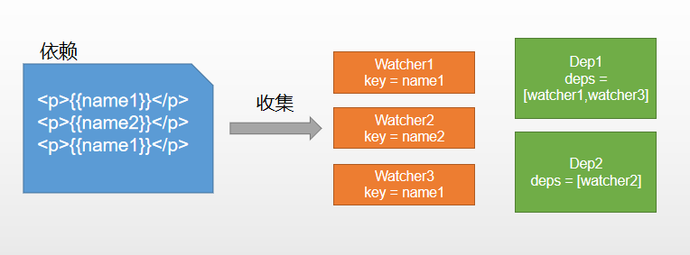

**实现思路**
1. defineReactive时为每⼀个key创建⼀个Dep实例
2. 初始化视图时读取某个key，例如name1，创建⼀个watcher1
3. 由于触发name1的getter⽅法，便将watcher1添加到name1对应的Dep中
4. 当name1更新， setter触发时，便可通过对应Dep通知其管理所有Watcher更新  

```js
class Dep {

    constructor() {
        this.deps = []
    }

    addDep(watcher) {
        this.deps.push(watcher)
    }

    notify() {
        this.deps.forEach(dep => dep.update())
    }
}
```

### 调试源码

#### 获取vue  

项目地址：https://github.com/vuejs/vue
迁出项目： `git clone https://github.com/vuejs/vue.git`
当前版本号：2.6.11  

#### 文件结构

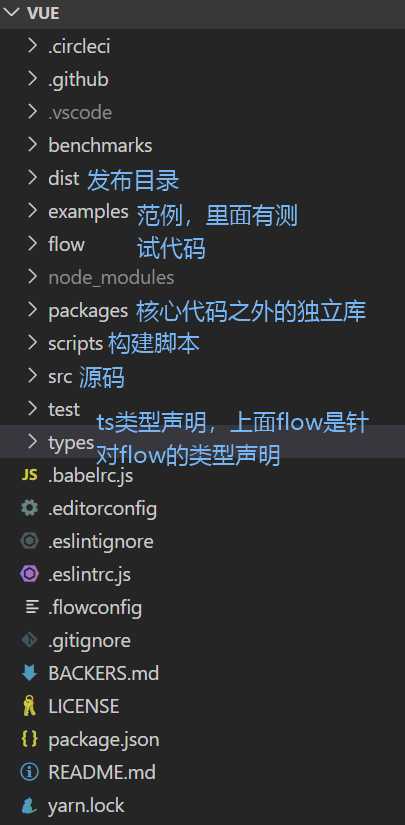

src目录


#### 调试环境搭建  

- 安装依赖： npm i
- 安装rollup： npm i -g rollup
- 修改dev脚本，添加sourcemap，package.json

```json
"dev": "rollup -w -c scripts/config.js --sourcemap --environment TARGET:webfull-dev",
```


- 运行开发命令： npm run dev
- 引入前面创建的vue.js，samples/commits/index.html

```html
<script src="../../dist/vue.js"></script> 
```


术语解释：

- runtime：仅包含运行时，不包含编译器
- common：cjs规范，用于webpack1
- esm：ES模块，用于webpack2+
- umd: universal module definition，兼容cjs和amd，用于浏览器  

####  入口  

dev脚本中 `-c scripts/config.js` 指明配置文件所在
参数 `TARGET:web-full-dev` 指明输出文件配置项，line:123  

```json
// Runtime+compiler development build (Browser)
{
    'web-full-dev': {
        entry: resolve('web/entry-runtime-with-compiler.js'), // 入口
        dest: resolve('dist/vue.js'),// 目标文件
        format: 'umd', // 输出规范
        env: 'development',
        alias: { he: './entity-decoder' },
        banner,
    },
}
```

#### 初始化流程  

- `new Vue()`
  - `_init()`
- `$mount`
  - `mountComponent()`
    - `updateComponent()`
      - `render()`
      - `update()`
    - `new Watcher()`

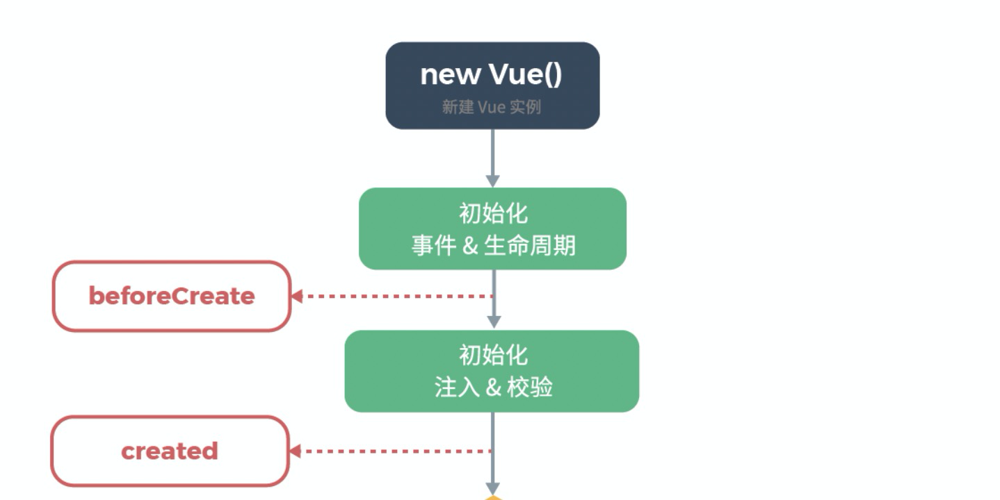

入口 `platforms/web/entry-runtime-with-compiler.js`  

扩展默认`$mount`方法：处理template或el选项  


`platforms/web/runtime/index.js`  

安装web平台特有指令和组件

定义__patch__：补丁函数，执行patching算法进行更新

定义`$mount`：挂载vue实例到指定宿主元素（获得dom并替换宿主元素）  


`core/index.js`  

初始化全局api
具体如下：  

```js
Vue.set = set
Vue.delete = del
Vue.nextTick = nextTick
initUse(Vue) // 实现Vue.use函数
initMixin(Vue) // 实现Vue.mixin函数
initExtend(Vue) // 实现Vue.extend函数
initAssetRegisters(Vue) // 注册实现Vue.component/directive/filter
```


`core/instance/index.js`  

Vue构造函数定义

定义Vue实例API  

```js
function Vue (options) {
// 构造函数仅执行了_init
this._init(options)
} i
nitMixin(Vue) // 实现init函数
stateMixin(Vue) // 状态相关api $data,$props,$set,$delete,$watch
eventsMixin(Vue)// 事件相关api $on,$once,$off,$emit
lifecycleMixin(Vue) // 生命周期api _update,$forceUpdate,$destroy
renderMixin(Vue)// 渲染api _render,$nextTick
```


`core/instance/init.js  `

创建组件实例，初始化其数据、属性、事件等  

```js
initLifecycle(vm) // $parent,$root,$children,$refs
initEvents(vm) // 处理父组件传递的事件和回调
initRender(vm) // $slots,$scopedSlots,_c,$createElement
callHook(vm, 'beforeCreate')
initInjections(vm) // 获取注入数据
initState(vm) // 初始化props，methods，data，computed，watch
initProvide(vm) // 提供数据注入
callHook(vm, 'created')
```


`$mount`
\- `mountComponent`

执行挂载，获取vdom并转换为dom

\- `new Watcher()`

创建组件渲染watcher

\- `updateComponent()`

执行初始化或更新

\- `update()`

初始化或更新，将传入vdom转换为dom，初始化时执行的是dom创建操作

\- `render()` `src\core\instance\render.js`

渲染组件，获取vdom  

整体流程捋一捋  

``new Vue() => _init() => $mount() => mountComponent() =>`
updateComponent()+new Watcher() => render() => _update()`  

#### 面试题：谈谈vue生命周期

- 概念：组件创建、更新和销毁过程
- 用途：生命周期钩子使我们可以在合适的时间做合适的事情
- 分类列举：
  - 初始化阶段：beforeCreate、created、beforeMount、mounted
  - 更新阶段：beforeUpdate、updated
  - 销毁阶段：beforeDestroy、destroyed
- 应用：
  - created时，所有数据准备就绪，适合做数据获取、赋值等数据操作
  - mounted时，$el已生成，可以获取dom；子组件也已挂载，可以访问它们
  - updated时，数值变化已作用于dom，可以获取dom最新状态
  - destroyed时，组件实例已销毁，适合取消定时器等操作  

#### 数据响应式  

数据响应式是MVVM框架的一大特点，通过某种策略可以感知数据的变化。Vue中利用了JS语言特性Object.defineProperty()，通过定义对象属性getter/setter拦截对属性的访问。

具体实现是在Vue初始化时，会调用initState，它会初始化data，props等，这里着重关注data初始化，  

整体流程  

`initState (vm: Component) src\core\instance\state.js`

初始化数据，包括props、methods、data、computed和watch

**initData核心代码是将data数据响应化**

```JS
function initData (vm: Component) {
    // 执行数据响应化
    observe(data, true /* asRootData */)
}
```

`core/observer/index.js`

observe方法返回一个Observer实例

Observer对象根据数据类型执行对应的响应化操作

defineReactive定义对象属性的getter/setter，getter负责添加依赖，setter负责通知更新

`core/observer/dep.js`

Dep负责管理一组Watcher，包括watcher实例的增删及通知更新

`Watcher`

Watcher解析一个表达式并收集依赖，当数值变化时触发回调函数，常用于$watch API和指令中。

每个组件也会有对应的Watcher，数值变化会触发其update函数导致重新渲染

```js
export default class Watcher {
    constructor () {}
    get () {}
    addDep (dep: Dep) {}
    update () {}
}
```

#### 数组响应化  

数组数据变化的侦测跟对象不同，我们操作数组通常使用push、pop、splice等方法，此时没有办法得
知数据变化。所以vue中采取的策略是拦截这些方法并通知dep  

`src\core\observer\array.js`

为数组原型中的7个可以改变内容的方法定义拦截器

Observer中覆盖数组原型  

```js
if (Array.isArray(value)) {
    // 替换数组原型
    protoAugment(value, arrayMethods) // value.__proto__ = arrayMethods
    this.observeArray(value)
}
```

### 异步更新队列

Vue⾼效的秘诀是⼀套批量、异步的更新策略


- 事件循环Event Loop：浏览器为了协调事件处理、脚本执⾏、⽹络请求和渲染等任务⽽制定的⼯作机制。
- 宏任务Task：代表⼀个个离散的、独⽴的⼯作单元。 浏览器完成⼀个宏任务，在下⼀个宏任务执⾏开始前，会对⻚⾯进⾏重新渲染。主要包括创建⽂档对象、解析HTML、执⾏主线JS代码以及各种事件如⻚⾯加载、输⼊、⽹络事件和定时器等。
- 微任务：微任务是更⼩的任务，是在当前宏任务执⾏结束后⽴即执⾏的任务。 如果存在微任务，浏览器会清空微任务之后再重新渲染。 微任务的例⼦有 Promise 回调函数、 DOM变化等  

> [Tasks, microtasks, queues and schedules](https://jakearchibald.com/2015/tasks-microtasks-queues-and-schedules/?utm_source=html5weekly)

#### vue中的具体实现 


- 异步：只要侦听到数据变化， Vue 将开启⼀个队列，并缓冲在同⼀事件循环中发⽣的所有数据变更。
- 批量：如果同⼀个 watcher 被多次触发，只会被推⼊到队列中⼀次。去重对于避免不必要的计算和 DOM 操作是⾮常重要的。然后，在下⼀个的事件循环“tick”中， Vue 刷新队列执⾏实际⼯作。
- 异步策略： Vue 在内部对异步队列尝试使⽤原⽣的 Promise.then 、 MutationObserver或 setImmediate ，如果执⾏环境都不⽀持，则会采⽤ setTimeout 代替。  

`update() core\observer\watcher.js`

dep.notify()之后watcher执⾏更新，执⾏⼊队操作

`queueWatcher(watcher) core\observer\scheduler.js`

执⾏watcher⼊队操作

`nextTick(flushSchedulerQueue) core\util\next-tick.js`

nextTick按照特定异步策略执⾏队列操作

### 虚拟DOM  

虚拟DOM（Virtual DOM）是对DOM的JS抽象表示，它们是JS对象，能够描述DOM结构和关系。应⽤的各种状态变化会作⽤于虚拟DOM，最终映射到DOM上。  

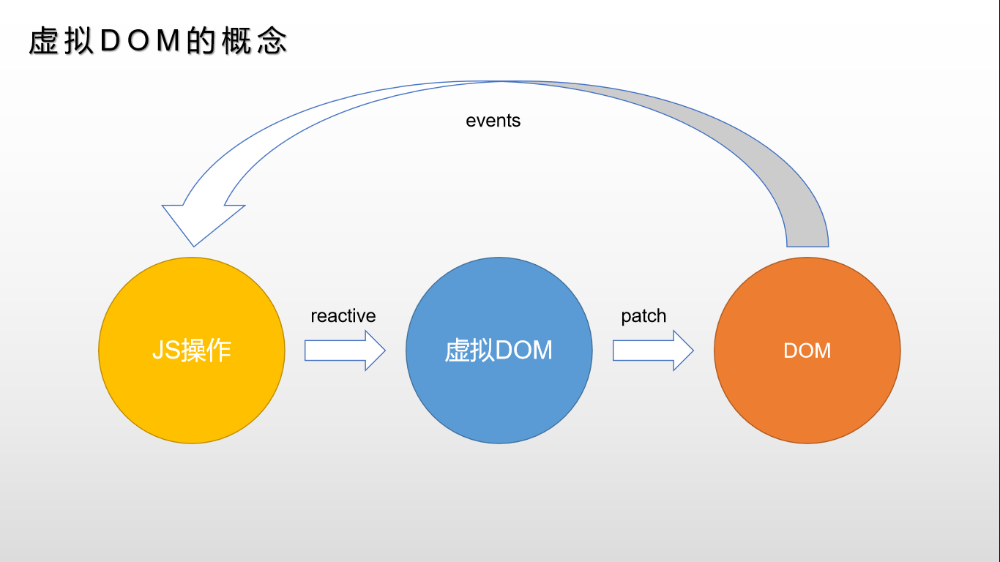

#### 体验虚拟DOM

vue中虚拟dom基于snabbdom实现，安装snabbdom并体验  

```html
<!DOCTYPE html>
<html lang="en">
    <head></head>
    <body>
        <div id="app"></div>
        <!--安装并引⼊snabbdom-->
        <script src="../../node_modules/snabbdom/dist/snabbdom.js"></script>
        <script>
            // 之前编写的响应式函数
            function defineReactive(obj, key, val) {
                Object.defineProperty(obj, key, {
                    get() {
                        return val
                    },
                    set(newVal) {
                        val = newVal
                        // 通知更新
                        update()
                    }
                })
            }
            // 导⼊patch的⼯⼚init， h是产⽣vnode的⼯⼚
            const { init, h } = snabbdom
            // 获取patch函数
            const patch = init([])
            // 上次vnode，由patch()返回
            let vnode;
            // 更新函数，将数据操作转换为dom操作，返回新vnode
            function update() {
                if (!vnode) {
                    // 初始化，没有上次vnode，传⼊宿主元素和vnode
                    vnode = patch(app, render())
                }
                else {
                    // 更新，传⼊新旧vnode对⽐并做更新
                    vnode = patch(vnode, render())
                }
            }
            // 渲染函数，返回vnode描述dom结构
            function render() {
                return h('div', obj.foo)
            }
            // 数据
            const obj = {}
            // 定义响应式
            defineReactive(obj, 'foo', '')
            // 赋⼀个⽇期作为初始值
            obj.foo = new Date().toLocaleTimeString()
            // 定时改变数据，更新函数会重新执⾏
            setInterval(() => {
                obj.foo = new Date().toLocaleTimeString()
            }, 1000);
        </script>
    </body>
</html>
```

#### 优点

- 虚拟DOM轻量、快速：当它们发⽣变化时通过新旧虚拟DOM⽐对可以得到最⼩DOM操作量，配合异步更新策略减少刷新频率，从⽽提升性能  

```js
patch(vnode, h('div', obj.foo))
```

- 跨平台：将虚拟dom更新转换为不同运⾏时特殊操作实现跨平台  

```html
<script src="../../node_modules/snabbdom/dist/snabbdom-style.js"></script>
<script>
    // 增加style模块
    const patch = init([snabbdom_style.default])
    function render() {
        // 添加节点样式描述
        return h('div', { style: { color: 'red' } }, obj.foo)
    }
</script>
```

- 兼容性：还可以加⼊兼容性代码增强操作的兼容性 

#### 必要性  

vue 1.0中有细粒度的数据变化侦测，它是不需要虚拟DOM的，但是细粒度造成了⼤量开销，这对于⼤型项⽬来说是不可接受的。因此， vue 2.0选择了中等粒度的解决⽅案，每⼀个组件⼀个watcher实例，这样状态变化时只能通知到组件，再通过引⼊虚拟DOM去进⾏⽐对和渲染。  

#### 整体流程  

`mountComponent() core/instance/lifecycle.js  `

渲染、更新组件  

```js
// 定义更新函数
const updateComponent = () => {
    // 实际调⽤是在lifeCycleMixin中定义的_update和renderMixin中定义的_render
    vm._update(vm._render(), hydrating)
}
```

`render core/instance/render.js`

⽣成虚拟dom

`_update core\instance\lifecycle.js`

update负责更新dom，转换vnode为dom

`__patch__() platforms/web/runtime/index.js`

`__patch__`是在平台特有代码中指定的  

```js
Vue.prototype.__patch__ = inBrowser ? patch : noop
```

##### patch获取

patch是createPatchFunction的返回值，传递nodeOps和modules是web平台特别实现  

```js
export const patch: Function = createPatchFunction({ nodeOps, modules })
```

`platforms\web\runtime\node-ops.js`

定义各种原⽣dom基础操作⽅法

`platforms\web\runtime\modules\index.js`

modules 定义了属性更新实现

`watcher.run() => componentUpdate() => render() => update() => patch()  `

##### patch实现  

`patch core\vdom\patch.js`

⾸先进⾏树级别⽐较，可能有三种情况：增删改。
- new VNode不存在就删；
- old VNode不存在就增；
- 都存在就执⾏diff执⾏更新  

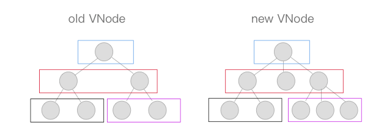

##### `patchVnode`

⽐较两个VNode，包括三种类型操作： 属性更新、⽂本更新、⼦节点更新
具体规则如下：
1. 新⽼节点均有children⼦节点，则对⼦节点进⾏diff操作，调⽤updateChildren
2. 如果新节点有⼦节点⽽⽼节点没有⼦节点，先清空⽼节点的⽂本内容，然后为其新增⼦节点  
3. 当新节点没有⼦节点⽽⽼节点有⼦节点的时候，则移除该节点的所有⼦节点。
4. 当新⽼节点都⽆⼦节点的时候，只是⽂本的替换。  

例子：
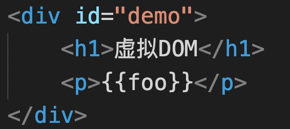

```js
// patchVnode过程分解
// 1.div#demo updateChildren
// 2.h1 updateChildren
// 3.text ⽂本相同跳过
// 4.p updateChildren
// 5.text setTextContent
```

##### `updateChildren`

updateChildren主要作⽤是⽤⼀种较⾼效的⽅式⽐对新旧两个VNode的children得出最⼩操作补丁。执⾏⼀个双循环是传统⽅式， vue中针对web场景特点做了特别的算法优化，我们看图说话：  

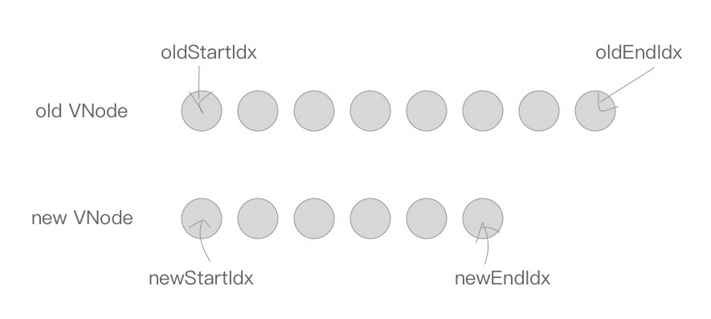

在新⽼两组VNode节点的左右头尾两侧都有⼀个变量标记，在遍历过程中这⼏个变量都会向中间靠拢。

当oldStartIdx > oldEndIdx或者newStartIdx > newEndIdx时结束循环。

下⾯是遍历规则：

⾸先， oldStartVnode、 oldEndVnode与newStartVnode、 newEndVnode两两交叉⽐较，共有4种⽐较⽅法。  

当 oldStartVnode和newStartVnode 或者 oldEndVnode和newEndVnode 满⾜sameVnode，直接将该VNode节点进⾏patchVnode即可，不需再遍历就完成了⼀次循环。如下图，  

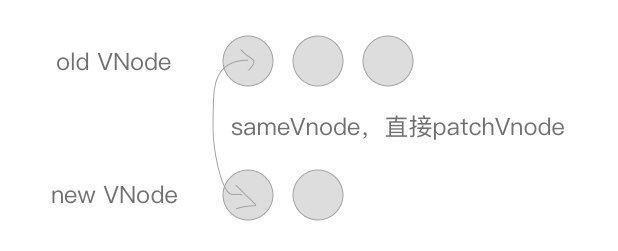

如果oldStartVnode与newEndVnode满⾜sameVnode。说明oldStartVnode已经跑到了oldEndVnode后⾯去了，进⾏patchVnode的同时还需要将真实DOM节点移动到oldEndVnode的后⾯。  

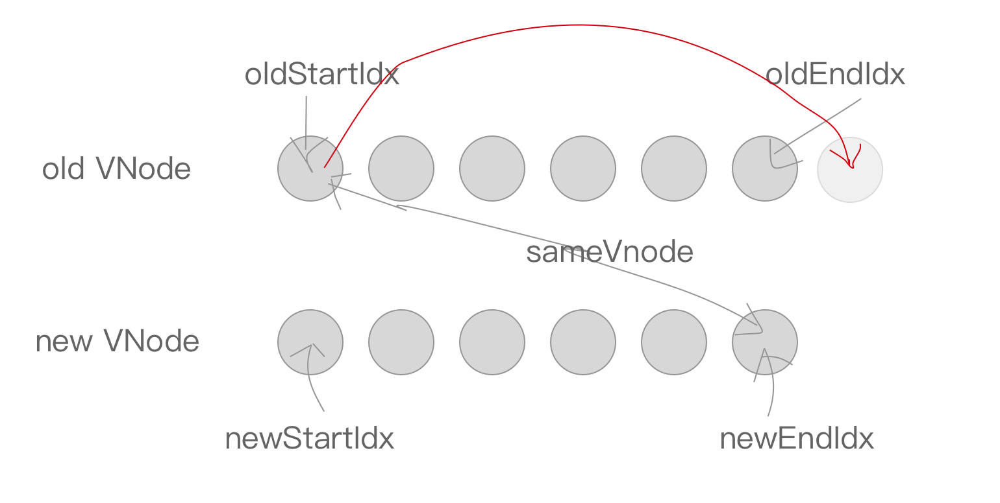

如果oldEndVnode与newStartVnode满⾜sameVnode，说明oldEndVnode跑到了oldStartVnode的前⾯，进⾏patchVnode的同时要将oldEndVnode对应DOM移动到oldStartVnode对应DOM的前⾯。  

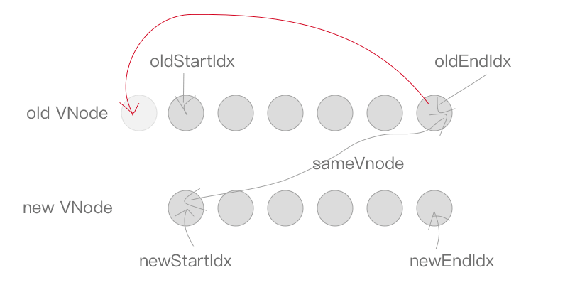

如果以上情况均不符合，则在old VNode中找与newStartVnode相同的节点，若存在执⾏patchVnode，同时将elmToMove移动到oldStartIdx对应的DOM的前⾯  

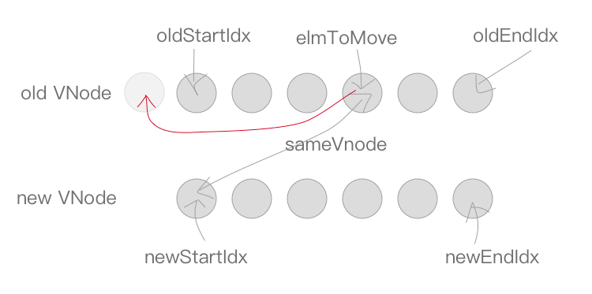

当然也有可能newStartVnode在old VNode节点中找不到⼀致的sameVnode，这个时候会调⽤createElm创建⼀个新的DOM节点。  

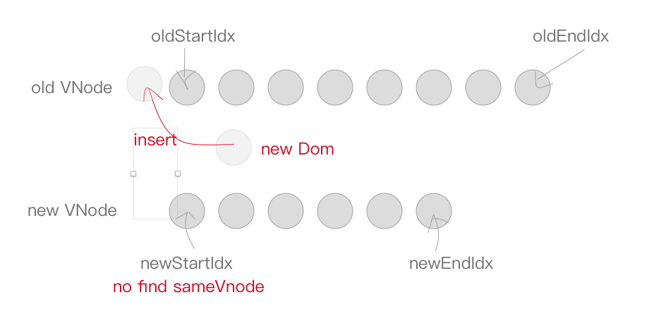

⾄此循环结束，但是我们还需要处理剩下的节点。

当结束时oldStartIdx > oldEndIdx，这个时候旧的VNode节点已经遍历完了，但是新的节点还没有。说明了新的VNode节点实际上⽐⽼的VNode节点多，需要将剩下的VNode对应的DOM插⼊到真实DOM中，此时调⽤addVnodes（批量调⽤createElm接⼝）。  

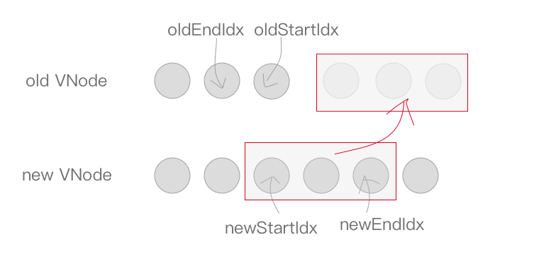

但是，当结束时newStartIdx > newEndIdx时，说明新的VNode节点已经遍历完了，但是⽼的节点还有剩余，需要从⽂档中将多余的节点删除  

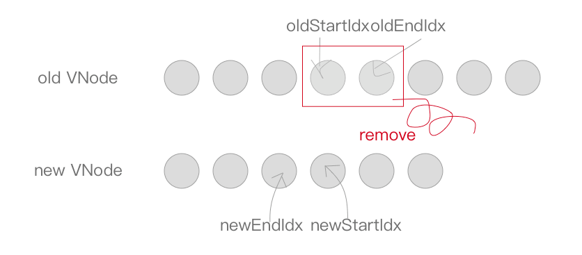

### 模板编译  

模板编译的主要⽬标是将模板(template)转换为渲染函数(render)  

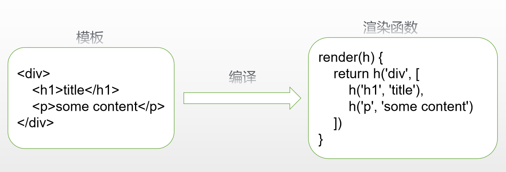

template => render()  

#### 必要性  

Vue 2.0需要⽤到VNode描述视图以及各种交互，⼿写显然不切实际，因此⽤户只需编写类似HTML代码的Vue模板，通过编译器将模板转换为可返回VNode的render函数  

#### 体验模板编译  

带编译器的版本中，可以使⽤template或el的⽅式声明模板

```html
<div id="demo">
    <h1>Vue模板<span>编译</span></h1>
    <p v-if="foo">{{foo}}</p>
    <comp></comp>
</div>
<script>
    Vue.component('comp', {
        template: '<div>I am comp</div>'
    })
    // 创建实例
    const app = new Vue({
        el: '#demo',
        data: {foo:'foo'}
    });
    // 输出render函数
    console.log(app.$options.render);
</script>
```

输出的render函数

```js
(function anonymous() {
    with(this){return _c('div',{attrs:{"id":"demo"}},[
        _c('h1',[_v("Vue模板编译")]),
        _v(" "),_c('p',[_v(_s(foo))]),
        _v(" "),_c('comp')],1)}
})
```

> 元素节点使⽤createElement创建，别名\_c
> 本⽂节点使⽤createTextVNode创建，别名\_v
> 表达式先使⽤toString格式化，别名\_s
> 其他渲染`helpers： src\core\instance\render-helpers\index.js`  

#### 整体流程  

##### `compileToFunctions`

若指定template或el选项，则会执⾏编译， 

`platforms\web\entry-runtime-with-compiler.js`

**编译过程**

编译分为三步：解析、优化和⽣成， `src\compiler\index.js  `

##### 解析 - parse  

解析器将模板解析为抽象语法树，基于AST可以做优化或者代码⽣成⼯作。

调试查看得到的AST， `/src/compiler/parser/index.js`，结构如下：  

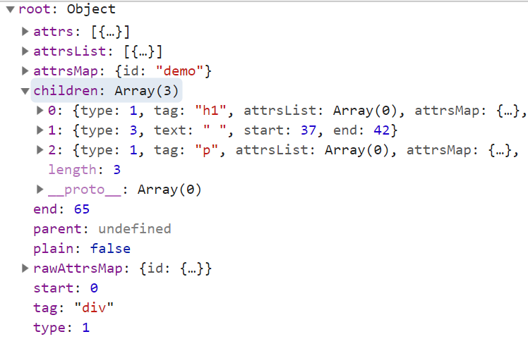

解析器内部分了HTML解析器、 ⽂本解析器和过滤器解析器，最主要是HTML解析器  

##### 优化 - optimize

优化器的作⽤是在AST中找出静态⼦树并打上标记。静态⼦树是在AST中永远不变的节点，如纯⽂本节点。  

标记静态⼦树的好处：

- 每次重新渲染，不需要为静态⼦树创建新节点
- 虚拟DOM中patch时，可以跳过静态⼦树  

```html
<div id="demo">
    <!-- 出现静态节点嵌套情况下会做优化标记 -->
    <h1>Vue<span>模板编译</span></h1>
    <p>{{foo}}</p>
    <comp></comp>
</div>
<script>
    Vue.component('comp', {
        template: '<div>I am comp</div>'
    })
    // 创建实例
    const app = new Vue({
        el: '#demo',
        data: {foo:'foo'}
    });
    // 输出render函数
    console.log(app.$options.render);
</script>
```

代码实现， `src/compiler/optimizer.js - optimize  `

标记结束  

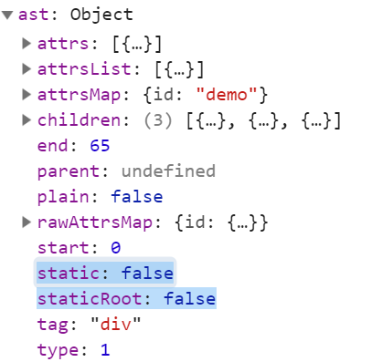

##### 代码⽣成 - generate  

将AST转换成渲染函数中的内容，即代码字符串。
generate⽅法⽣成渲染函数代码，` src/compiler/codegen/index.js  `

⽣成的code⻓这样  

```js
_c('div',{attrs:{"id":"demo"}},[
    _c('h1',[_v("Vue.js测试")]),
    _c('p',[_v(_s(foo))])
])
```

#### v-if、 v-for

着重观察⼏个结构性指令的解析过程

##### 解析v-if `parser/index.js`

processIf⽤于处理v-if解析

解析结果：


##### 代码⽣成， `codegen/index.js`

genIfConditions等⽤于⽣成条件语句相关代码
⽣成结果：  

```js
"with(this){
	return _c(
        'div',{
            attrs:{"id":"demo"}
        },[
            (foo) ? _c('h1',[_v(_s(foo))]) : _c('h1',[_v("no title")]),
            _v(" "),
            _c('abc')
        ],1)
    }"
```

##### 解析v-for： `parser/index.js`

processFor⽤于处理v-for指令
解析结果： 

```js
v-for="item in items" for:'items' alias:'item'  
```


##### 代码⽣成， `src\compiler\codegen\index.js：`

genFor⽤于⽣成相应代码  

⽣成结果  

```js
"with(this){
    return _c(
        'div',{
            attrs:{"id":"demo"}
        },[
            _m(0),
            _v(" "),
            (foo)?_c('p',[_v(_s(foo))]):_e(),
            _v(" "),
            _l((arr),
            function(s){return _c('b',{key:s},						[_v(_s(s))])}),
            _v(" "),
            _c('comp')
        ],2)
}"
```

> v-if， v-for这些指令只能在编译器阶段处理，如果我们要在render函数处理条件或循环只能使⽤if和for

```js
Vue.component('comp', {
    props: ['foo'],
    render(h) { // 渲染内容跟foo的值挂钩，只能⽤if语句
        if (this.foo=='foo') {
            return h('div', 'foo')
        }
        return h('div', 'bar')
    }
})
```

```js
(function anonymous(
) {
    with(this){
        return _c(
            'div',{
                attrs:{"id":"demo"}
            },[
                _m(0),
                _v(" "),
                (foo)?_c('p',[_v(_s(foo))]):_e(),
                _v(" "),_c('comp')
            ],1)
        }
})
```

### 组件化机制

#### 组件声明： Vue.component()

initAssetRegisters(Vue) `src/core/global-api/assets.js`
组件注册使⽤extend⽅法将配置转换为构造函数并添加到components选项

#### 组件实例创建及挂载

观察⽣成的渲染函数  

```js
"with(this){
    return _c(
        'div',{
            attrs:{"id":"demo"}
        },[
            _c('h1',[_v("虚拟DOM")]),
            _v(" "),
            _c('p',[_v(_s(foo))]),
            _v(" "),
            _c('comp') // 对于组件的处理并⽆特殊之处
        ],1)
}"
```

#### 整体流程  

⾸先创建的是根实例，⾸次_render()时，会得到整棵树的VNode结构，其中⾃定义组件相关的主要有：
createComponent() - `src/core/vdom/create-component.js`

组件vnode创建

createComponent() - `src/core/vdom/patch.js`  

创建组件实例并挂载， vnode转换为dom

整体流程：
new Vue() => \$mount() => vm.\_render() => createElement() => createComponent()
=> vm.\_update() => patch() => createElm => createComponent()  

##### 创建组件VNode

\_createElement - `src\core\vdom\create-element.js`

\_createElement实际执⾏VNode创建的函数，由于传⼊tag是⾮保留标签，因此判定为⾃定义组件通过createComponent去创建

createComponent - `src/core/vdom/create-component.js`

创建组件VNode，保存了上⼀步处理得到的组件构造函数， props，事件等

##### 创建组件实例

根组件执⾏更新函数时，会递归创建⼦元素和⼦组件，⼊⼝createElm

createEle() `core/vdom/patch.js line751`

⾸次执⾏\_update()时， patch()会通过createEle()创建根元素，⼦元素创建研究从这⾥开始

createComponent `core/vdom/patch.js line144`

⾃定义组件创建  

```js
// 组件实例创建、挂载
if (isDef(i = i.hook) && isDef(i = i.init)) {
    i(vnode, false /* hydrating */)
}
if (isDef(vnode.componentInstance)) {
    // 元素引⽤指定vnode.elm，元素属性创建等
    initComponent(vnode, insertedVnodeQueue)
    // 插⼊到⽗元素
    insert(parentElm, vnode.elm, refElm)
    if (isTrue(isReactivated)) {
        reactivateComponent(vnode, insertedVnodeQueue, parentElm, refElm)
    }
    return true
}
```

### 事件处理整体流程  

- 编译阶段：处理为data中的on  

```js
(function anonymous() {
    with(this){
        return _c(
            'div',{
                attrs:{"id":"demo"}
            },[
                _c('h1',[_v("事件处理机制")]),
                _v(" "),
                _c('p',{on:{"click":onClick}},[_v("this is p")]),
                _v(" "),
                _c('comp',{on:{"myclick":onMyClick}})
            ],1)
    }
})
```

- 初始化阶段：
  - 原生事件监听 platforms/web/runtime/modules/events.js
    - 事件也是作为属性处理
    - 整体流程：patch() => createElm() => invodeCreateHooks() =>
      updateDOMListeners()
  - 自定义事件监听 initEvents core/instance/events.js
    - 整体流程：patch() => createElm() => createComponent() => hook.init() =>
      createComponent... => \_init() => initEvents() => updateComponentListeners()

> 事件监听和派发者均是组件实例，自定义组件中一定伴随着原生事件的监听与处理  

### hook

在Vue当中，hooks可以作为一种event，在Vue的源码当中，称之为hookEvent。  

```vue
<Table @hook:updated="handleTableUpdated"></Table>
```

场景：有一个来自第三方的复杂表格组件，表格进行数据更新的时候渲染时间需要1s，由于渲染时间较
长，为了更好的用户体验，我希望在表格进行更新时显示一个loading动画。修改源码这个方案很不优
雅。  

callHook `src\core\instance\lifecycle.js`  

```js
export function callHook (vm: Component, hook: string) {
    // ...
    // 若包含hook事件，则一并派发
    if (vm._hasHookEvent) {
        vm.$emit('hook:' + hook)
    }
}
```

$on `src\core\instance\events.js`  

```js
const hookRE = /^hook:/
Vue.prototype.$on = function (event: string | Array<string>, fn: Function):
Component {
    // 若存在hook事件则添加标记
    if (hookRE.test(event)) {
        vm._hasHookEvent = true
    }
}
```

### 双向绑定实现机制  

v-model是mvvm类型框架中重要功能，给人印象最深刻的就是它，它是怎么实现的？且看下面分解  

```html
<div id="demo">
    <h1>双向绑定机制</h1>
    <!--表单控件绑定-->
    <input type="text" v-model="foo">
    <!--自定义事件-->
    <comp v-model="foo"></comp>
</div>
<script src="../../dist/vue.js"></script>
<script>
    // 声明自定义组件
    Vue.component('comp', {
        template: `
                <input type="text" :value="$attrs.value"
                @input="$emit('input', $event.target.value)">
                `
    })
    // 创建实例
    const app = new Vue({
        el: '#demo',
        data: { foo: 'foo' }
    });

    console.log(app.$options.render);

</script>
```

输出的render函数  

```js
// 生成的渲染函数
(function anonymous() {
    with(this){
        return _c(
            'div',{
                attrs:{"id":"demo"}
            },[
                _c('h1',[_v("双向绑定机制")]),
                _v(" "),
                _c('input',{
                    directives:[
                        {
                            name:"model",
                            rawName:"v-model",
                            value:(foo),
                            expression:"foo"
                        }
                    ],
                    attrs:{"type":"text"},
                    domProps:{"value":(foo)},
                    on:{
                        "input":function($event){
                            if($event.target.composing)return;
                            foo=$event.target.value
                        }
                    }
                }),
                _v(" "),
                _c('comp',{
                    model:{
                        value:(foo),
                        callback:function ($$v){foo=$$v},
                        expression:"foo"
                    }
                })
            ],1)}
})
// input
_c(
    'input',{
        directives:[
            {
                name:"model",
                rawName:"v-model",
                value:(foo),
                expression:"foo"}
        ],
        attrs:{"type":"text"},
        domProps:{"value":(foo)},
        on:{
            "input":function($event){
                if($event.target.composing) return;
                foo=$event.target.value
            }
        }
    })
// comp
_c('comp',
   {
    model:{
        value:(foo),
        callback:function ($$v) {foo=$$v},
        expression:"foo"
    }
})
```

#### 初始化阶段：对节点赋值及事件监听  

- 对节点赋值 platforms\web\runtime\modules\dom-props.js
- 事件监听 platforms\web\runtime\modules\events.js
- 额外的model指令 platforms\web\runtime\directives\model.js
- 自定义组件会转换为属性和事件 core/vdom/create-component.js  

## vue-ssr

服务端渲染：将vue实例渲染为HTML字符串直接返回，在前端激活为交互程序  

优点

- seo
- 首屏内容到达时间  

### 基础http服务  

```js
// nodejs代码
const express = require('express')
// 获取express实例
const server = express()
// 编写路由处理不同url请求
server.get('/', (req, res)=>{
    res.send('<strong>hello world</strong>')
})
// 监听端口
server.listen(80, () => {
    console.log('server running!');
})
```

### 基础实现  

使用渲染器将vue实例成HTML字符串并返回  

安装vue-server-renderer  

```shell
# 确保版本相同且匹配
npm i vue vue-server-renderer -S 
```

使用vue-server-renderer

```js
// 1.创建vue实例
const Vue = require('vue')
const app = new Vue({
    template: '<div>hello world</div>'
})
// 2.获取渲染器实例
const { createRenderer } = require('vue-server-renderer')
const renderer = createRenderer()
// 3.用渲染器渲染vue实例
renderer.renderToString(app).then(html => {
    console.log(html);
}).catch(err => {
    console.log(err);
})
```

整合express  

```js
// nodejs代码
const express = require('express')
// 获取express实例
const server = express()
const Vue = require('vue')
// 2.获取渲染器实例
const { createRenderer } = require('vue-server-renderer')
const renderer = createRenderer()
// 编写路由处理不同url请求
server.get('/', (req, res) => {
    // res.send('<strong>hello world</strong>')
    // 1.创建vue实例
    const app = new Vue({
        template: '<div @click="onClick">{{msg}}</div>',
        data() {
            return {msg:'vue ssr'}
        },
        methods: {
            onClick() {
                console.log('do something');
            }
        },
    })
    // 3.用渲染器渲染vue实例
    renderer.renderToString(app).then(html => {
        res.send(html)
    }).catch(err => {
        res.status(500)
        res.send('Internal Server Error, 500!')
    })
})
// 监听端口
server.listen(80, () => {
    console.log('server running!');
})
```

### 理解ssr  

#### 传统web开发

网页内容在服务端渲染完成，一次性传输到浏览器  

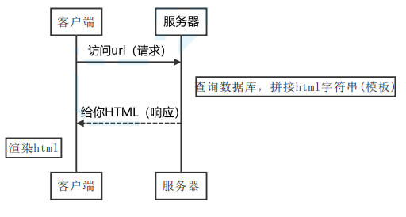

```js
// 客户端渲染，返回给客户端的只是页面骨架，没有实际内容
// 真正的内容是在客户端使用js动态生成的
const express = require('express')
const app = express()

app.get('/', function (req, res) {
  const html = `
    <div id="app">
      <h1>{{title}}</h1>
      <p>{{content}}</p>
    </div>
    <script src="https://cdn.jsdelivr.net/npm/vue/dist/vue.js"></script>
    <script>
      new Vue({
        el:'#app',
        data:{
          title:'wzp', 
          content:'wzp真不错'
        }
      })
    </script>
  `
  res.send(html)
})

app.listen(3000)
```

打开页面查看源码，浏览器拿到的是全部的dom结构  

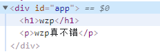

#### 单页应用 Single Page App  

单页应用优秀的用户体验，使其逐渐成为主流，页面内容由JS渲染出来，这种方式称为客户端渲染。  

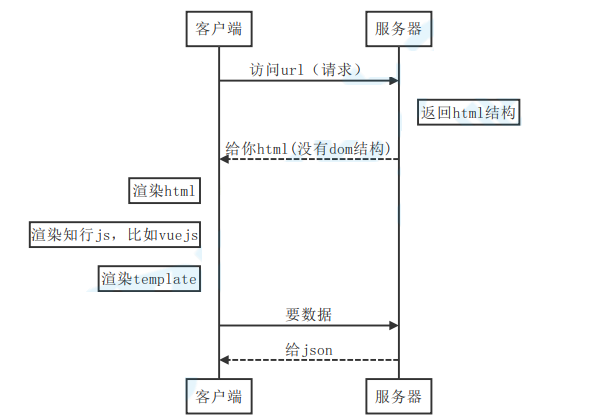

打开页面查看源码，浏览器拿到的仅有宿主元素#app，并没有内容。  

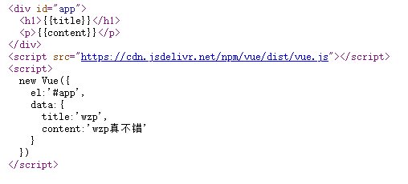

SPA问题：

- seo
- 首屏加载速度  

#### 服务端渲染 Server Side Render  

SSR解决方案，后端渲染出完整的首屏的dom结构返回，前端拿到的内容包括首屏及完整SPA结构，应用激活后依然按照spa方式运行，这种页面渲染方式被称为服务端渲染 (server side render)  

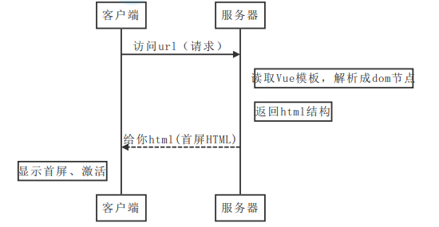

### vue-ssr实战  

#### 新建工程

vue-cli创建工程即可  

```shell
# 演示项目使用vue-cli 4.x创建
vue create ssr
```

#### 安装依赖  

```bash
# 要确保vue、vue-server-renderer版本一致
npm install vue-server-renderer@2.6.10 -S
```

#### 启动脚本  

创建一个express服务器，将vue ssr集成进来

```js
// 创建一个express实例
const express = require('express')

const app = express()

// 导入vue
const Vue = require('vue')

// 创建渲染器
const { createRenderer } = require('vue-server-renderer')

const renderer = createRenderer()

app.get("/", async (req, res) => {
    // 创建一个待渲染vue实例
    const vm = new Vue({
        data: { name: "wzp真棒" },
        template: `
                <div>
                	<h1>{{name}}</h1>
                </div>
                `
    });
    try {
        // renderToString将vue实例渲染为html字符串，它返回一个Promise
        const html = await renderer.renderToString(vm);
        // 返回html给客户端
        res.send(html);
    } catch (error) {
        // 渲染出错返回500错误
        res.status(500).send("Internal Server Error");
    }
});
app.listen(3000);
```

#### 路由

路由支持仍然使用vue-router

#### 安装

若未引入vue-router则需要安装  

```bash
npm i vue-router -s
```

#### 创建路由实例

每次请求的url委托给vue-router处理

```js
// 引入vue-router
const Router = require('vue-router')
Vue.use(Router)
// path修改为通配符
app.get('*', async function (req, res) {
    // 每次创建一个路由实例
    const router = new Router({
        routes: [
            { path: "/", component: {template:'<div>index page</div>'} },
            { path: "/detail", component: {template:'<div>detail page</div>'} }
        ]
    });
    const vm = new Vue({
        data: { msg: 'wzp真棒' },
        // 添加router-view显示内容
        template: `
                <div>
                    <router-link to="/">index</router-link>
                    <router-link to="/detail">detail</router-link>
                    <router-view></router-view>
                </div>`,
        router, // 挂载
    })
    try {
        // 跳转至对应路由
        router.push(req.url);
        const html = await renderer.renderToString(vm)
        res.send(html)
    } catch (error) {
        res.status(500).send('渲染出错')
    }
})
```

#### 同构开发SSR应用  

对于同构开发，我们依然使用webpack打包，我们要解决两个问题：服务端首屏渲染和客户端激活  

##### 构建流程  

目标是生成一个「服务器 bundle」用于服务端首屏渲染，和一个「客户端bundle」用于客户端激活。  

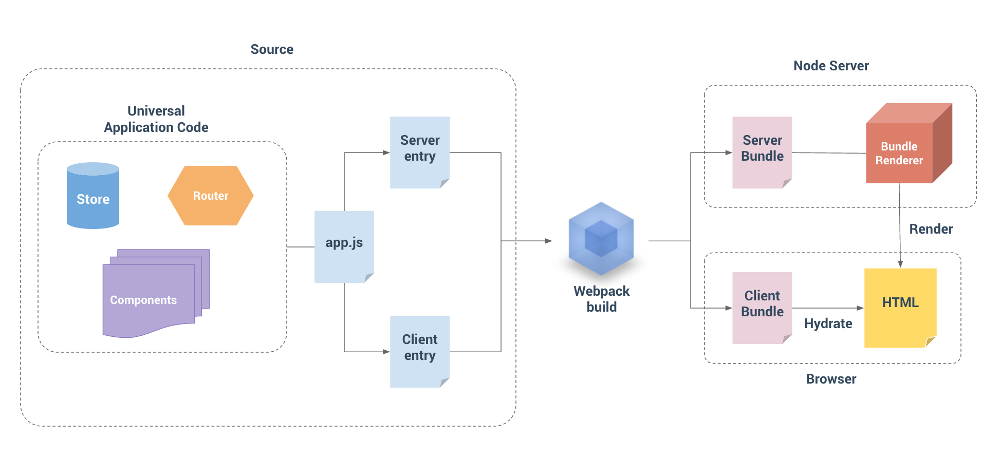

##### 代码结构  

除了两个不同入口之外，其他结构和之前vue应用完全相同  

```markdown
src
├── router
├────── index.js # 路由声明
├── store
├────── index.js # 全局状态
├── main.js # 用于创建vue实例
├── entry-client.js # 客户端入口，用于静态内容“激活”
└──
entry-server.js # 服务端入口，用于首屏内容渲染
```

##### 路由配置  

创建`@/router/index.js` 

```js
import Vue from "vue";
import Router from "vue-router";
Vue.use(Router);
//导出工厂函数
export function createRouter() {
    return new Router({
        mode: 'history',
        routes: [
            // 客户端没有编译器，这里要写成渲染函数
            { path: "/", component: { render: h => h('div', 'index page') } },
            { path: "/detail", component: { render: h => h('div', 'detail page') } }
        ]
    });
}
```

#####  主文件  

跟之前不同，主文件是负责创建vue实例的工厂，每次请求均会有独立的vue实例创建。创建main.js：  

```js
import Vue from "vue";
import App from "./App.vue";
import { createRouter } from "./router";
// 导出Vue实例工厂函数，为每次请求创建独立实例
// 上下文用于给vue实例传递参数
export function createApp(context) {
    const router = createRouter();
    const app = new Vue({
        router,
        context,
        render: h => h(App)
    });
    return { app, router };
}
```

##### 服务端入口  

上面的bundle就是webpack打包的服务端bundle，我们需要编写服务端入口文件src/entry-server.js
它的任务是创建Vue实例并根据传入url指定首屏  

```js
import { createApp } from "./main";
// 返回一个函数，接收请求上下文，返回创建的vue实例
export default context => {
    // 这里返回一个Promise，确保路由或组件准备就绪
    return new Promise((resolve, reject) => {
        const { app, router } = createApp(context);
        // 跳转到首屏的地址
        router.push(context.url);
        // 路由就绪，返回结果
        router.onReady(() => {
            resolve(app);
        }, reject);
    });
};
```

##### 客户端入口

客户端入口只需创建vue实例并执行挂载，这一步称为激活。创建entry-client.js：  

```js
import { createApp } from "./main";
// 创建vue、router实例
const { app, router } = createApp();
// 路由就绪，执行挂载
router.onReady(() => {
    app.$mount("#app");
});
```

##### webpack配置

安装依赖  

```bash
npm install webpack-node-externals lodash.merge -D
```

具体配置，vue.config.js  

```js
// 两个插件分别负责打包客户端和服务端
const VueSSRServerPlugin = require("vue-server-renderer/server-plugin");
const VueSSRClientPlugin = require("vue-server-renderer/client-plugin");
const nodeExternals = require("webpack-node-externals");
const merge = require("lodash.merge");
// 根据传入环境变量决定入口文件和相应配置项
const TARGET_NODE = process.env.WEBPACK_TARGET === "node";
const target = TARGET_NODE ? "server" : "client";
module.exports = {
    css: {
        extract: false
    },
    outputDir: './dist/'+target,
    configureWebpack: () => ({
        // 将 entry 指向应用程序的 server / client 文件
        entry: `./src/entry-${target}.js`,
        // 对 bundle renderer 提供 source map 支持
        devtool: 'source-map',
        // target设置为node使webpack以Node适用的方式处理动态导入，
        // 并且还会在编译Vue组件时告知`vue-loader`输出面向服务器代码。
        target: TARGET_NODE ? "node" : "web",
        // 是否模拟node全局变量
        node: TARGET_NODE ? undefined : false,
        output: {
            // 此处使用Node风格导出模块
            libraryTarget: TARGET_NODE ? "commonjs2" : undefined
        },
        // https://webpack.js.org/configuration/externals/#function
        // https://github.com/liady/webpack-node-externals
        // 外置化应用程序依赖模块。可以使服务器构建速度更快，并生成较小的打包文件。
        externals: TARGET_NODE
        ? nodeExternals({
            // 不要外置化webpack需要处理的依赖模块。
            // 可以在这里添加更多的文件类型。例如，未处理 *.vue 原始文件，
            // 还应该将修改`global`（例如polyfill）的依赖模块列入白名单
            whitelist: [/\.css$/]
        })
        : undefined,
        optimization: {
            splitChunks: undefined
        },
        // 这是将服务器的整个输出构建为单个 JSON 文件的插件。
        // 服务端默认文件名为 `vue-ssr-server-bundle.json`
        // 客户端默认文件名为 `vue-ssr-client-manifest.json`。
        plugins: [TARGET_NODE ? new VueSSRServerPlugin() : new VueSSRClientPlugin()]
    }),
    chainWebpack: config => {
        // cli4项目添加
        if (TARGET_NODE) {
            config.optimization.delete('splitChunks')
        } 
        config.module
            .rule("vue")
            .use("vue-loader")
            .tap(options => {
            merge(options, {
                optimizeSSR: false
            });
        });
    }
};
```

##### 脚本配置

安装依赖  

```bash
npm i cross-env -D
```

定义创建脚本，package.json  

```json
"scripts": {
    "build:client": "vue-cli-service build",
    "build:server": "cross-env WEBPACK_TARGET=node vue-cli-service build",
    "build": "npm run build:server && npm run build:client"
},
```

> 执行打包：npm run build  

##### 宿主文件  

最后需要定义宿主文件，修改`./public/index.html`  

```HTML
<!DOCTYPE html>
<html lang="en">
    <head>
        <meta charset="utf-8">
        <meta http-equiv="X-UA-Compatible" content="IE=edge">
        <meta name="viewport" content="width=device-width,initial-scale=1.0">
        <title>Document</title>
    </head>
    <body>
        <!--vue-ssr-outlet-->
    </body>
</html>
```

##### 服务器启动文件  

修改服务器启动文件，现在需要处理所有路由，`./server/04-ssr.js`  

```JS
// 获取文件路径
const resolve = dir => require('path').resolve(__dirname, dir)
// 第 1 步：开放dist/client目录，关闭默认下载index页的选项，不然到不了后面路由
app.use(express.static(resolve('../dist/client'), {index: false}))
// 第 2 步：获得一个createBundleRenderer
const { createBundleRenderer } = require("vue-server-renderer");
// 第 3 步：服务端打包文件地址
const bundle = resolve("../dist/server/vue-ssr-server-bundle.json");
// 第 4 步：创建渲染器
const renderer = createBundleRenderer(bundle, {
    runInNewContext: false, // https://ssr.vuejs.org/zh/api/#runinnewcontext
    template: require('fs').readFileSync(resolve("../public/index.html"), "utf-
                                         8"), // 宿主文件
                                         clientManifest: require(resolve("../dist/client/vue-ssr-clientmanifest.json")) // 客户端清单
});
app.get('*', async (req,res)=>{
    // 设置url和title两个重要参数
    const context = {
        title:'ssr test',
        url:req.url
    } c
    onst html = await renderer.renderToString(context);
    res.send(html)
})
```

##### 整合Vuex  

安装vuex  

```BASH
npm install -S vuex
```

```js
// store/index.js
import Vue from 'vue'
import Vuex from 'vuex'
Vue.use(Vuex)
export function createStore () {
    return new Vuex.Store({
        state: {
            count:108
        },
        mutations: {
            add(state){
                state.count += 1;
            }
        }
    })
}
```

挂载store，main.js  

```js
import { createStore } from './store'
export function createApp (context) {
    // 创建实例
    const store = createStore()
    const app = new Vue({
        store, // 挂载
        render: h => h(App)
    })
    return { app, router, store }
}
```

使用，`.src/App.vue`  

```vue
<h2 @click="$store.commit('add')">{{$store.state.count}}</h2>
```

> 注意事项：注意打包和重启服务  

##### 数据预取  

服务器端渲染的是应用程序的"快照"，如果应用依赖于一些异步数据，那么在开始渲染之前，需要先预
取和解析好这些数据。
异步数据获取，`store/index.js`  

```js
export function createStore() {
    return new Vuex.Store({
        mutations: {
            // 加一个初始化
            init(state, count) {
                state.count = count;
            },
        },
        actions: {
            // 加一个异步请求count的action
            getCount({ commit }) {
                return new Promise(resolve => {
                    setTimeout(() => {
                        commit("init", Math.random() * 100);
                        resolve();
                    }, 1000);
                });
            },
        },
    });
}
```

组件中的数据预取逻辑，index.vue  

```js
export default {
    asyncData({ store, route }) { // 约定预取逻辑编写在预取钩子asyncData中
        // 触发 action 后，返回 Promise 以便确定请求结果
        return store.dispatch("getCount");
    }
};
```

服务端数据预取，entry-server.js

```js
import { createApp } from "./app";
export default context => {
    return new Promise((resolve, reject) => {
        // 拿出store和router实例
        const { app, router, store } = createApp(context);
        router.push(context.url);
        router.onReady(() => {
            // 获取匹配的路由组件数组
            const matchedComponents = router.getMatchedComponents();
            // 若无匹配则抛出异常
            if (!matchedComponents.length) {
                return reject({ code: 404 });
            } /
            / 对所有匹配的路由组件调用可能存在的`asyncData()`
            Promise.all(
                matchedComponents.map(Component => {
                    if (Component.asyncData) {
                        return Component.asyncData({
                            store,
                            route: router.currentRoute,
                        });
                    }
                }),
            )
                .then(() => {
                // 所有预取钩子 resolve 后，
                // store 已经填充入渲染应用所需状态
                // 将状态附加到上下文，且 `template` 选项用于 renderer 时，
                // 状态将自动序列化为 `window.__INITIAL_STATE__`，并注入 HTML。
                context.state = store.state;
                resolve(app);
            })
                .catch(reject);
        }, reject);
    });
};
```

客户端在挂载到应用程序之前，store 就应该获取到状态，entry-client.js  

```js
// 导出store
const { app, router, store } = createApp();
// 当使用 template 时，context.state 将作为 window.__INITIAL_STATE__ 状态自动嵌入到最
终的 HTML // 在客户端挂载到应用程序之前，store 就应该获取到状态：
if (window.__INITIAL_STATE__) {
    store.replaceState(window.__INITIAL_STATE__);
}
```

客户端数据预取处理，main.js  

```js
Vue.mixin({
    beforeMount() {
        const { asyncData } = this.$options;
        if (asyncData) {
            // 将获取数据操作分配给 promise
            // 以便在组件中，我们可以在数据准备就绪后
            // 通过运行 `this.dataPromise.then(...)` 来执行其他任务
            this.dataPromise = asyncData({
                store: this.$store,
                route: this.$route,
            });
        }
    },
});
```

## TypeScript

### 准备工作  

#### 新建一个基于ts的vue项目  


#### 在已存在项目中安装typescript  

```shell
vue add @vue/typescript
```

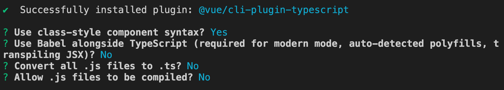

> 请暂时忽略引发的几处Error，它们不会影响项目运行，我们将在后面处理它们。  

