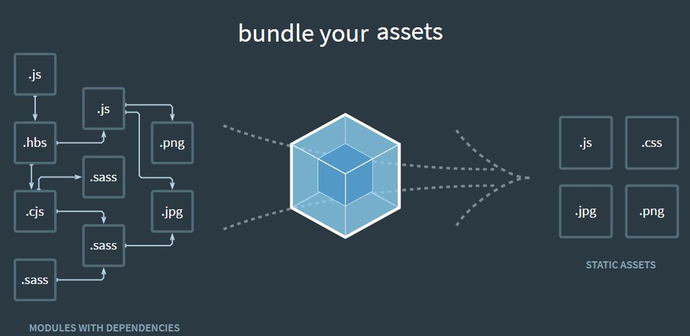
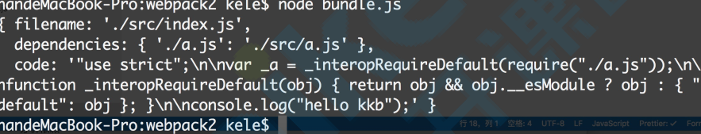

# 这可不是我的笔记嗷

[[toc]]

## webpack简介
官⽅⽹站： https://webpack.js.org/

webpack is a module bundler(模块打包⼯具)



Webpack是⼀个打包模块化JavaScript的⼯具，它会从⼊⼝模块出发，识别出源码中的模块化导⼊语句，递归地找出⼊⼝⽂件的所有依赖，将⼊⼝和其所有的依赖打包到⼀个单独的⽂件中

这是⼯程化、⾃动化思想在前端开发中的体现

## 安装webpack

### 环境准备

nodeJs https://nodejs.org/en/

版本参考官⽹发布的最新版本，可以提升webpack的打包速度

### 全局安装 不推荐

```shell
# 安装webpack V4+版本时，需要额外安装webpack-cli
npm install webpack webpack-cli -g
# 检查版本
webpack -v
# 卸载
npm uninstall webpack webpack-cli -g
```

全局安装webpack，这会将你项⽬中的webpack锁定到指定版本，造成不同的项⽬中因为webpack依赖不同版本⽽导致冲突，构建失败

### 项⽬安装 推荐

```shell
# 安装最新的稳定版本
npm i -D webpack
# 安装指定版本
npm i -D webpack@<version>
# 安装最新的体验版本 可能包含bug,不要⽤于⽣产环境
npm i -D webpack@beta
# 安装webpack V4+版本时，需要额外安装webpack-cli
npm i -D webpack-cli
```

### 检查安装

```shell
#command not found 默认在全局环境中查找
webpack -v 
# npx帮助我们在项⽬中的node_modules⾥查找webpack
npx webpack -v
#到当前的node_modules模块⾥指定webpack
./node_modules/.bin/webpack -v
```

## 启动webpack执行构建                                                                                     

### webpack默认配置                                                                                    

1.  webpack默认⽀持JS模块和JSON模块
2.  ⽀持CommonJS Es moudule AMD等模块类型
3.  webpack4⽀持零配置使⽤,但是很弱，稍微复杂些的场景都需要额外扩展


### 准备执行构建                                  

1. 新建src⽂件夹
2. 新建src/index.js、src/index.json、src/other.js
```js
// index.js
const json = require("./index.json");//commonJS
import { add } from "./other.js";//es module
console.log(json, add(2, 3));
```
```js
// index.json
{
  "name": "JOSN"
}
```
```js
// other.js
export function add(n1, n2) {
  return n1 + n2;
}
```
### 执⾏构建                                                                                           
```shell
# npx⽅式
npx webpack

# npm script
npm run test
```

修改package.json⽂件：
```js
  "scripts": {
    "test": "webpack"
  },
```
原理就是通过shell脚本在node_modules/.bin⽬录下创建⼀个软链接。

### 构建成功                                                                                            

我们会发现⽬录下多出⼀个 dist ⽬录，⾥⾯有个 main.js  ，这个⽂件是⼀个可执⾏的JavaScript⽂件，⾥⾯包含webpackBootstrap启动函数。

### 默认配置                          

```js                                                                  
const path = require("path");
module.exports = {
    // 必填  webpack执⾏构建⼊⼝
    entry: "./src/index.js",
    output: {
        //  将所有依赖的模块合并输出到main.js
        filename: "main.js",
        //  输出⽂件的存放路径，必须是绝对路径
        path: path.resolve(__dirname, "./dist")
    }
};
```

## webpack配置核⼼概念                                                                                     

零配置是很弱的，特定的需求，总是需要⾃⼰进⾏配置

webpack有默认的配置⽂件，叫webpack.config.js，我们可以对这个⽂件进⾏修改，进⾏个性化配
置
- 使⽤默认的配置⽂件：webpack.config.js
- 不使⽤⾃定义配置⽂件： ⽐如webpackconfig.js，可以通过--config webpackconfig.js来指定
- webpack使⽤哪个配置⽂件来执⾏构建

webpack.config.js配置基础结构
```js
module.exports = {
  entry: "./src/index.js", //打包⼊⼝⽂件
  output: "./dist", //输出结构
  mode: "production", //打包环境
  module: {
    rules: [
      //loader模块处理
      {
        test: /\.css$/,
        use: "style-loader"
      }
    ]
  },
  plugins: [new HtmlWebpackPlugin()] //插件配置
};
```

### entry                                                                                  
指定webpack打包⼊⼝⽂件:Webpack 执⾏构建的第⼀步将从 Entry 开始，可抽象成输⼊
```js
//单⼊⼝ SPA，本质是个字符串
entry:{
  main: './src/index.js'
}
===相当于简写===
entry:"./src/index.js"


//多⼊⼝ entry是个对象
entry:{
  index:"./src/index.js",
  login:"./src/login.js"
}
```

### output                                                                                         

打包转换后的⽂件输出到磁盘位置:输出结果，在 Webpack 经过⼀系列处理并得出最终想要的代码后输出结果。
```js
output: {
    filename: "bundle.js",//输出⽂件的名称
    path: path.resolve(__dirname, "dist")//输出⽂件到磁盘的⽬录，必须是绝对路径
},
  
//多⼊⼝的处理
output: {
    filename: "[name][chunkhash:8].js",//利⽤占位符，⽂件名称不要重复
    path: path.resolve(__dirname, "dist")//输出⽂件到磁盘的⽬录，必须是绝对路径
}, 
```

### mode                                                                                            

Mode⽤来指定当前的构建环境

1. production
2. development
3. none

设置mode可以⾃动触发webpack内置的函数，达到优化的效果

| 选项        | 描述                                                                                                                                                                                                                   |
| ----------- | ---------------------------------------------------------------------------------------------------------------------------------------------------------------------------------------------------------------------- |
| development | 会将DefinePlugin中process.env.NODE_ENV的值设置为development。启用NamedChunksPlugin和NamedModulesPlugin                                                                                                                 |
| production  | 会将DefinePlugin中process.env.NODE_ENV的值设置为production。启用FlagDependcyUsagePlugin，FlagIncludedChunksPlugin，ModuleConcationPlugin,NoEmitOnErrorsPlugin,OccurrenceOrderPlugin,SideEffectsFlgPlugin和TerserPlugin |
| none        | 退出任何默认优化选项                                                                                                                                                                                                   |

如果没有设置，webpack会将mode的默认值设置为production

开发阶段的开启会有利于热更新的处理，识别哪个模块变化

⽣产阶段的开启会有帮助模块压缩，处理副作⽤等⼀些功能

 

 

### loader                                                                         

模块解析，模块转换器，⽤于把模块原内容按照需求转换成新内容。

webpack是模块打包⼯具，⽽模块不仅仅是js，还可以是css，图⽚或者其他格式

但是webpack默认只知道如何处理js和JSON模块，那么其他格式的模块处理，和处理⽅式就需要loader了

loader 处理webpack不⽀持的格式⽂件、模块

⼀个loader只处理⼀件事情

loader有执⾏顺序

常⻅的loader
```js
style-loader
css-loader
less-loader
sass-loader
ts-loader //将Ts转换成js
babel-loader//转换ES6、7等js新特性语法
file-loader//处理图⽚⼦图
eslint-loader
...
```

#### file-loader 

处理静态资源模块

原理是把打包⼊⼝中识别出的资源模块，移动到输出⽬录，并且返回⼀个地址名称

所以我们什么时候⽤file-loader呢？

场景：就是当我们需要模块，仅仅是从源代码挪移到打包⽬录，就可以使⽤file-loader来处理，txt，svg，csv，excel，图⽚资源啦等等
    

```shell
npm install file-loader -D
```

案例：
```js
module: {
    rules: [
        {
            test: /\.(png|jpe?g|gif)$/,
            //use使⽤⼀个loader可以⽤对象，字符串，两个loader需要⽤数组
            use: {
                loader: "file-loader",
                //   options额外的配置，⽐如资源名称
                options: {
                    //  placeholder 占位符  [name]⽼资源模块的名称
                    //   [ext]⽼资源模块的后缀
                    // https://webpack.js.org/loaders/file-loader#placeholders
                    name: "[name]_[hash].[ext]",
                    //打包后的存放位置
                    outputPath: "images/"
                }
            }
        }
    ]
},
```

```js
import pic from "./logo.png";

var img = new Image();
img.src = pic;
img.classList.add("logo");

var root = document.getElementById("root");
root.append(img);
```


- 处理字体 https://www.iconfont.cn/?spm=a313x.7781069.1998910419.d4d0a486a
```css
//css
@font-face {
  font-family: "webfont";
  font-display: swap;
  src: url("webfont.woff2") format("woff2");
}

body {
  background: blue;
  font-family: "webfont" !important;
}


//webpack.config.js
{
  test: /\.(eot|ttf|woff|woff2|svg)$/,
  use: "file-loader"
}
```

#### url-loader (file-loader加强版本)

url-loader内部使⽤了file-loader,所以可以处理file-loader所有的事情，但是遇到jpg格式的模块，会把该图⽚转换成base64格式字符串，并打包到js⾥。对⼩体积的图⽚⽐较合适，⼤图⽚不合适。

```shell
npm install url-loader -D
```


案例；
```js
module: {
  rules: [
    {
      test: /\.(png|jpe?g|gif)$/,
      use: {
        loader: "url-loader",
        options: {
          name: "[name]_[hash].[ext]",
          outputPath: "images/",
          //⼩于2048，才转换成base64
          limit: 2048
        }
      }
    }
  ]
},
```

#### style-loader,css-loader

处理样式

分析css模块之间的关系，并合成⼀个css

 会把css-loader⽣成的内容，以style挂载到⻚⾯的heade部分
```shell
npm install style-loader css-loader -D
```

```js
{
    test: /\.css$/,
        use: ["style-loader", "css-loader"]
}


{
    test:/\.css$/,
        use:[{
            loader:"style-loader",
            options: {
                injectType: "singletonStyleTag" // 将所有的style标签合并成⼀个
            }
        },"css-loader"]
}
```

####  less-load

Less样式处理

 把less语法转换成css

```shell
npm install less less-loader --save-dev
```


案例：

loader有顺序，从右到左，从下到上

```js
{
    test: /\.scss$/,
        use: ["style-loader", "css-loader", "less-loader"]
}
```

#### postcss-loader

样式⾃动添加前缀：https://caniuse.com/

```bash
npm i  postcss-loader autoprefixer -D
```

```js
//webpack.config.js
{
    test: /\.css$/,
        use: ["style-loader", "css-loader", "postcss-loader"]
},
```
新建postcss.config.js
```js
//postcss.config.js
module.exports = {
    plugins: [
        require("autoprefixer")({
            overrideBrowserslist: ["last 2 versions", ">1%"] 
        })
    ]
};

```


### moudle                                                                                          

模块，在 Webpack ⾥⼀切皆模块，⼀个模块对应着⼀个⽂件。Webpack 会从配置的 Entry 开始递归找出所有依赖的模块。

当webpack处理到不认识的模块时，需要在webpack中的module处进⾏配置，当检测到是什么格式的模块，使⽤什么loader来处理。
```js
module:{
    rules:[
        {
            test:/\.xxx$/,//指定匹配规则
            use:{
                loader: 'xxx-load'//指定使⽤的loader
            }
        }
    ]
}
```


### Plugins                                                                                           

plugin 可以在webpack运⾏到某个阶段的时候，帮你做⼀些事情，类似于⽣命周期的概念

扩展插件，在 Webpack 构建流程中的特定时机注⼊扩展逻辑来改变构建结果或做你想要的事情。

作⽤于整个构建过程

#### HtmlWebpackPlugin                                                                                   

htmlwebpackplugin会在打包结束后，⾃动⽣成⼀个html⽂件，并把打包⽣成的js模块引⼊到该html
中。

```shell
npm install --save-dev html-webpack-plugin
```

配置：

```markdown
title: ⽤来⽣成⻚⾯的 title 元素

filename: 输出的 HTML ⽂件名，默认是 index.html, 也可以直接配置带有⼦⽬录。

template: 模板⽂件路径，⽀持加载器，⽐如 html!./index.html

inject: true | 'head' | 'body' | false  ,注⼊所有的资源到特定的 template 或者 

templateContent 中，如果设置为 true 或者 body，所有的 javascript 资源将被放置到 body 元素的底部，'head' 将放置到 head 元素中。

favicon: 添加特定的 favicon 路径到输出的 HTML ⽂件中。

minify: {} | false , 传递 html-minifier 选项给 minify 输出

hash: true | false, 如果为 true, 将添加⼀个唯⼀的 webpack 编译 hash 到所有包含的脚本和CSS ⽂件，对于解除 cache 很有⽤。

cache: true | false，如果为 true, 这是默认值，仅仅在⽂件修改之后才会发布⽂件。

showErrors: true | false, 如果为 true, 这是默认值，错误信息会写⼊到 HTML ⻚⾯中

chunks: 允许只添加某些块 (⽐如，仅仅 unit test 块)

chunksSortMode: 允许控制块在添加到⻚⾯之前的排序⽅式，⽀持的值：'none' | 'default' | {function}-default:'auto'

excludeChunks: 允许跳过某些块，(⽐如，跳过单元测试的块) 
```


案例：

webpack.config.js

```js
const path = require("path");
const htmlWebpackPlugin = require("html-webpack-plugin");
module.exports = {
    ...
    plugins: [
        new htmlWebpackPlugin({clean-webpack-plugin
                               title: "My App",
                               filename: "app.html",
                               template: "./src/index.html"
                              })
    ]
};
```

index.html

```html
<!DOCTYPE html>
<html lang="en">
    <head>
        <meta charset="UTF-8" />
        <meta name="viewport" content="width=device-width, initial-scale=1.0" />
        <meta http-equiv="X-UA-Compatible" content="ie=edge" />
        <title><%= htmlWebpackPlugin.options.title %></title>
	</head>
    <body>
        <div id="root"></div>
    </body>
</html>
```

#### clean-webpack-plugin                                                                                
```shell
npm install --save-dev clean-webpack-plugin
```

```js
const { CleanWebpackPlugin } = require("clean-webpack-plugin");

...

plugins: [
    new CleanWebpackPlugin()
]
```

#### mini-css-extract-plugin                                                                             

```js
const MiniCssExtractPlugin = require("mini-css-extract-plugin");


{
    test: /\.css$/,
        use: [MiniCssExtractPlugin.loader, "css-loader"]
}


new MiniCssExtractPlugin({
    filename: "[name][chunkhash:8].css"
})
```


## 如何⾃⼰编写⼀个Loader                                                                                      

⾃⼰编写⼀个Loader的过程是⽐较简单的，

Loader就是⼀个函数，声明式函数，不能⽤箭头函数

拿到源代码，作进⼀步的修饰处理，再返回处理后的源码就可以了

官⽅⽂档：https://webpack.js.org/contribute/writing-a-loader/

接⼝⽂档：https://webpack.js.org/api/loaders/

简单案例                                                                                                

- 创建⼀个替换源码中字符串的loader
```js
//index.js
console.log("hello wzp");
```
```js
//replaceLoader.js
module.exports = function(source) {
    console.log(source, this, this.query);
    return source.replace('wzp','略略略')
};

//需要⽤声明式函数，因为要上到上下⽂的this,⽤到this的数据，该函数接受⼀个参数，是源码
```


- 在配置⽂件中使⽤loader

需要使⽤node核⼼模块path来处理路径

```js
const path = require('path')
module: {
    rules: [
        {
            test: /\.js$/,
            use: path.resolve(__dirname, "./loader/replaceLoader.js")
        }
    ]
},
```
### 如何给loader配置参数，loader如何接受参数?

- this.query
- loader-utils

webpack.config.js
```js
module: {
    rules: [
        {
            test: /\.js$/,
            use: [
                {
                    loader: path.resolve(__dirname, "./loader/replaceLoader.js"),
                    options: {
                        name: "略略略"
                    }
                }
            ]
        }
    ]
},
```
replaceLoader.js

```js
//const loaderUtils = require("loader-utils");//官⽅推荐处理loader,query的⼯具

module.exports = function(source) {
    //this.query 通过this.query来接受配置⽂件传递进来的参数

    //return source.replace("wzp", this.query.name);
    const options = loaderUtils.getOptions(this);
    const result = source.replace("wzp", options.name);
    return source.replace("wzp", options.name);
}
```


this.callback :如何返回多个信息，不⽌是处理好的源码呢，可以使⽤this.callback来处理
```js
//replaceLoader.js
const loaderUtils = require("loader-utils");//官⽅推荐处理loader,query的⼯具

module.exports = function(source) {
    const options = loaderUtils.getOptions(this);
    const result = source.replace("wzp", options.name);
    this.callback(null, result);
};


//this.callback(
err: Error | null,
    content: string | Buffer,
        sourceMap?: SourceMap,
        meta?: any
);
```


this.async：如果loader⾥⾯有异步的事情要怎么处理呢
```js
const loaderUtils = require("loader-utils");

module.exports = function(source) {
    const options = loaderUtils.getOptions(this);
    setTimeout(() => {
        const result = source.replace("wzp", options.name);

        return result;
    }, 1000);
};
//先⽤setTimeout处理下试试，发现会报错
```
我们使⽤this.asycn来处理，他会返回this.callback

```js
const loaderUtils = require("loader-utils");

module.exports = function(source) {
  const options = loaderUtils.getOptions(this);

  //定义⼀个异步处理，告诉webpack,这个loader⾥有异步事件,在⾥⾯调⽤下这个异步
  //callback 就是 this.callback 注意参数的使⽤
  const callback = this.async();
  setTimeout(() => {
    const result = source.replace("wzp", options.name);
    callback(null, result);
  }, 3000);
};
```

多个loader的使⽤

replaceLoader.js

```js
module.exports = function(source) {
    return source.replace("略略略", "word");
};
//replaceLoaderAsync.js
const loaderUtils = require("loader-utils");
module.exports = function(source) {
    const options = loaderUtils.getOptions(this);
    //定义⼀个异步处理，告诉webpack,这个loader⾥有异步事件,在⾥⾯调⽤下这个异步
    const callback = this.async();
    setTimeout(() => {
        const result = source.replace("wzp", options.name);
        callback(null, result);
    }, 3000);
};
```

webpack.config.js
```js
module: {
    rules: [
        {
            test: /\.js$/,
            use: [
                path.resolve(__dirname, "./loader/replaceLoader.js"),
                {
                    loader: path.resolve(__dirname, "./loader/replaceLoaderAsync.js"),
                    options: {
                        name: "略略略"
                    }
                }
            ]
            // use: [path.resolve(__dirname, "./loader/replaceLoader.js")]

        }
    ]
},
```

顺序，⾃下⽽上，⾃右到左

处理loader的路径问题

```js
resolveLoader: {
    modules: ["node_modules", "./loader"]
},
    module: {
        rules: [
            {
                test: /\.js$/,
                use: [
                    "replaceLoader",
                    {
                        loader: "replaceLoaderAsync",
                        options: {
                            name: "略略略"
                        }
                    }
                ]
                // use: [path.resolve(__dirname, "./loader/replaceLoader.js")]
            }
        ]
    },
```


参考：loader API                                                                                       

https://webpack.js.org/api/loaders

## chunk、hash概念

chunk：⼀个⼊⼝肯定是⼀个chunk，但是⼀个chunk不⼀定只有⼀个依赖

hash：代码发生改变，重新打包hash会发生变化

Chunkhash：同属于一个chunk的hash才会发生变化

Contenthash：只有内容发生变化的模块的hash才会发生变化


webpack5.x 减少hash的概念

Contenthash

## 提升开发效率

### sourceMap                                                                       

1. 为了开发时，快速的定位问题

2. 线上代码，我们有时候也会开启 前端错误监控，快速的定位问题

源代码与打包后的代码的映射关系，通过sourceMap定位到源代码。

在dev模式中，默认开启，关闭的话 可以在配置⽂件⾥

```js
devtool:"none"
```

devtool的介绍：https://webpack.js.org/configuration/devtool#devtool

- eval：速度最快,使⽤eval包裹模块代码,

- source-map： 产⽣ `.map` ⽂件 外部产⽣ 错误代码的准确信息和位置

- cheap：较快，不包含列信息

- Module：第三⽅模块，包含loader的sourcemap（⽐如jsx to js ，babel的sourcemap）

- inline： 将 `.map` 作为DataURI嵌⼊，不单独⽣成`.map` ⽂件


配置推荐：

```js
devtool:"cheap-module-eval-source-map",// 开发环境配置

//线上不推荐开启
devtool:"cheap-module-source-map",   // 线上⽣成配置
```

### WebpackDevServer                                                               

提升开发效率的利器

每次改完代码都需要重新打包⼀次，打开浏览器，刷新⼀次，很麻烦,我们可以安装使⽤webpackdevserver来改善这块的体验

安装
```shell
npm install webpack-dev-server -D 
```
配置
修改下package.json
```js
"scripts": {
    "server": "webpack-dev-server"
},
```
在webpack.config.js配置：
```js
devServer: {
    contentBase: "./dist",
        open: true,
            port: 8081
},
```
启动
```shell
npm run server
```
启动服务后，会发现dist⽬录没有了，这是因为devServer把打包后的模块不会放在dist⽬录下，⽽是放到内存中，从⽽提升速度

本地mock,解决跨域：

- 前后端分离

- 前端和后端是可以并⾏开发的，

- 前端会依赖后端的接⼝

- 先给接⼝⽂档，和接⼝联调⽇期的

- 我们前端就可以本地mock数据，不打断⾃⼰的开发节奏

联调期间，前后端分离，直接获取数据会跨域，上线后我们使⽤nginx转发，开发期间，webpack就可以搞定这件事

```shell
npm i express -D 
```
用express启动⼀个服务器，mock⼀个接⼝：

创建⼀个server.js 修改package.json的scripts对象

```js
"server":"node server.js"
```

server.js
```js
const express = require('express')

const app = express()

app.get('/api/info', (req,res)=>{
    res.json({
        name:'略略略',
        age:5,
        msg:'欢迎来到开课吧学习前端⾼级课程'
    })
})

app.listen('9092')
```
```shell
node server.js
#http://localhost:9092/api/info
```

项⽬中安装axios⼯具

```shell
npm i axios -D
```

index.js

  ```js
  import axios from 'axios'
  axios.get('http://localhost:9092/api/info').then(res=>{
      console.log(res)
  })
  ```

这样写会有跨域问题

修改webpack.config.js 设置服务器代理

 ```js
 proxy: {
     "/api": {
         target: "http://localhost:9092"
     }
 }
 ```

修改index.js

```js
axios.get("/api/info").then(res => {
    console.log(res);
});
```

### Hot Module Replacement (HMR:热模块替换) 

不⽀持抽离出的css 我们要使⽤css-loader

启动hmr

```js
devServer: {
    contentBase: "./dist",
        open: true,
            hot:true,
                //即便HMR不⽣效，浏览器也不⾃动刷新，就开启hotOnly
                hotOnly:true
},
```

配置⽂件头部引⼊webpack

```js
//const path = require("path");
//const HtmlWebpackPlugin = require("html-webpack-plugin");
//const CleanWebpackPlugin = require("clean-webpack-plugin");

const webpack = require("webpack");
```

在插件配置处添加：

  ```js
  plugins: [
      new CleanWebpackPlugin(),
      new HtmlWebpackPlugin({
          template: "src/index.html"
      }),
      new webpack.HotModuleReplacementPlugin()
  ],
  ```

案例：

index.js

  ```js
  import "./css/index.css";
  
  var btn = document.createElement("button");
  btn.innerHTML = "新增";
  document.body.appendChild(btn);
  
  btn.onclick = function() {
      var div = document.createElement("div");
      div.innerHTML = "item";
      document.body.appendChild(div);
  };
  ```

index.css

 ```css
 div:nth-of-type(odd) {
     background: yellow;
 }
 ```

注意启动HMR后，css抽离会不⽣效，还有不⽀持contenthash，chunkhash

处理js模块HMR                                                                                           

需要使⽤module.hot.accept来观察模块更新 从⽽更新

案例：

counter.js

```js
function counter() {
    var div = document.createElement("div");
    div.setAttribute("id", "counter");
    div.innerHTML = 1;
    div.onclick = function() {
        div.innerHTML = parseInt(div.innerHTML, 10) + 1;
    };
    document.body.appendChild(div);
}
export default counter;
```

number.js

  ```js
  function number() {
      var div = document.createElement("div");
      div.setAttribute("id", "number");
      div.innerHTML = 13000;
      document.body.appendChild(div);
  }
  export default number;
  ```


index.js

```js
import counter from "./counter";
import number from "./number";

counter();
number();

if (module.hot) {
    module.hot.accept("./b", function() {
        document.body.removeChild(document.getElementById("number"));
        number();
    });
} 
```

## Babel处理ES6                                                        

官⽅⽹站：https://babeljs.io/

中⽂⽹站：https://www.babeljs.cn/

Babel是JavaScript编译器，能将ES6代码转换成ES5代码，让我们开发过程中放⼼使⽤JS新特性⽽不⽤担⼼兼容性问题。并且还可以通过插件机制根据需求灵活的扩展。

Babel在执⾏编译的过程中，会从项⽬根⽬录下的 `.babelrc`  JSON⽂件中读取配置。没有该⽂件会从loader的options地⽅读取配置。

测试代码                                                                                                

index.js

  ```js
  const arr = [new Promise(() => {}), new Promise(() => {})];
  
  arr.map(item => {
      console.log(item);
  });
  ```

安装                                                                                                  

 ```shell
 npm i babel-loader @babel/core @babel/preset-env -D
 ```

1. `babel-loader`是`webpack` 与 `babel`的通信桥梁，不会做把es6转成es5的⼯作，这部分⼯作需要⽤到`@babel/preset-env`来做

2. `@babel/preset-env`⾥包含了es，6，7，8转es5的转换规则

Webpack.config.js                                                                                   

```js
{
    test: /\.js$/,
    exclude: /node_modules/,
    use: {
        loader: "babel-loader",
        options: {
            presets: ["@babel/preset-env"]
        }
    }
},
"browserslist": [
  "last 2 version",
  "> 1%",
  "not ie < 11",
  "cover 99.5%",
  "dead"
]
```

通过上⾯的⼏步 还不够，默认的Babel只⽀持let等⼀些基础的特性转换，Promise等⼀些还有转换过来，这时候需要借助@babel/polyfill，把es的新特性都装进来，来弥补低版本浏览器中缺失的特性

@babel/polyfill                                                                                     

以全局变量的⽅式注⼊进来的。windows.Promise，它会造成全局对象的污染
```shell
npm install --save @babel/polyfill
```

index.js 顶部
```js
import "@babel/polyfill";
```

## 按需加载，减少冗余                                                                   

会发现打包的体积⼤了很多，这是因为polyfill默认会把所有特性注⼊进来，假如我想我⽤到的es6+，才会注⼊，没⽤到的不注⼊，从⽽减少打包的体积，可不可以呢?

当然可以

修改Webpack.config.js
```js
options: {
          presets: [
            [
              "@babel/preset-env",
              {
                targets: {
                  edge: "17",
                  firefox: "60",
                  chrome: "67",
                  safari: "11.1"
                },
                corejs: 2,//新版本需要指定核⼼库版本
                useBuiltIns: "entry"//按需注⼊
              }
            ]
          ]
        }
```
`useBuiltIns`选项是`babel7`的新功能，这个选项告诉babel如何配置`@babel/polyfill`。它有三个参数可以使⽤：

- ①`entry`:需要在webpack的⼊⼝⽂件⾥`import "@babel/polyfill"`⼀次。babel会根据你的使⽤情况导⼊垫⽚，没有使⽤的功能不会被导⼊相应的垫⽚。
- ②`usage`:不需要`import`，全⾃动检测，但是要安装`@babel/polyfill`。（试验阶段）
- ③`false`:如果你`import "@babel/polyfill"`，它不会排除掉没有使⽤的垫⽚，程序体积会庞⼤。(不推荐)

请注意： usage 的⾏为类似 `babel-transform-runtime`，不会造成全局污染，因此也会不会对类似`Array.prototype.includes()` 进⾏ polyfill。

扩展：

babelrc⽂件：

新建.babelrc⽂件，把options部分移⼊到该⽂件中，就可以了

.babelrc

```js
{
    presets: [
        [
            "@babel/preset-env",
            {
                targets: {
                    edge: "17",
                    firefox: "60",
                    chrome: "67",
                    safari: "11.1"
                },
                corejs: 2, //新版本需要指定核⼼库版本
                useBuiltIns: "usage" //按需注⼊
            }
        ]
    ]
}
```


webpack.config.js

```js
{
    test: /\.js$/,
    exclude: /node_modules/,
    loader: "babel-loader"
} 
```

配置React打包环境                                                                                         

安装

```shell
npm install react react-dom --save
```

解析插件

转换插件

编写react代码：

index.js

 ```jsx
 import React, { Component } from "react";
 import ReactDom from "react-dom";
 
 class App extends Component {
     render() {
         return <div>hello world</div>;
     }
 }
 
 ReactDom.render(<App />, document.getElementById("app"));
 ```

安装babel与react转换的插件：

 ```shell
 npm install --save-dev @babel/preset-react
 ```

在babelrc⽂件⾥添加：

 ```js
 {
     "presets": [
         [
             "@babel/preset-env",
             {
                 "targets": {
                     "edge": "17",
                     "firefox": "60",
                     "chrome": "67",
                     "safari": "11.1",
                     "Android":"6.0"
                 },
                 "useBuiltIns": "usage", //按需注⼊
             }
         ],
         "@babel/preset-react"
     ]
 }
 ```


如果是库的作者的话，提供模块的时候代码怎么打包的？

构建速度会越来越慢，怎么优化？

扩展：                                                                                                 

多⻚⾯打包通⽤⽅案                                                                                           

```js
entry:{
    index:"./src/index",
        list:"./src/list",
            detail:"./src/detail"
}

new htmlWebpackPlugins({
    title: "index.html",
    template: path.join(__dirname, "./src/index/index.html"),
    filename:"index.html",
    chunks:[index]
})
```

1.⽬录结构调整

- src
  - index
    - index.js
    - index.html
  - list
       - index.js
       - index.html
  - detail
       - index.js
       - index.html

2.使⽤ glob.sync 第三⽅库来匹配路径

```shell
npm i glob -D
```

```js
const glob = require("glob")
```

 MPA多⻚⾯打包通⽤⽅案
```js
const setMPA = () => {
    const entry = {};
    const htmlWebpackPlugins = [];
    return {
        entry,
        htmlWebpackPlugins
    };
};

const { entry, htmlWebpackPlugins } = setMPA();

const setMPA = () => {
    const entry = {};
    const htmlWebpackPlugins = [];

    const entryFiles = glob.sync(path.join(__dirname, "./src/*/index.js"));

    entryFiles.map((item, index) => {
        const entryFile = entryFiles[index];
        const match = entryFile.match(/src\/(.*)\/index\.js$/);
        const pageName = match && match[1];
        entry[pageName] = entryFile;
        htmlWebpackPlugins.push(
            new htmlWebpackPlugin({
                title: pageName,
                template: path.join(__dirname, `src/${pageName}/index.html`),
                filename: `${pageName}.html`,
                chunks: [pageName],
                inject: true
            })
        );
    });
    return {
        entry,
        htmlWebpackPlugins
    };
};

const { entry, htmlWebpackPlugins } = setMPA();

module.exports = {
    entry,
    output:{
        path: path.resolve(__dirname, "./dist"),
        filename: "[name].js"
    }
    plugins: [
    // ...
    ...htmlWebpackPlugins//展开数组
    ]
}
```


## 如何⾃⼰编写⼀个Plugin                                                                 

webpack 在编译代码过程中，会触发⼀系列 Tapable 钩⼦事件，插件所做的，就是找到相应的钩⼦，往上⾯挂上⾃⼰的任务，也就是注册事件，这样，当 webpack 构建的时候，插件注册的事件就会随着钩⼦的触发⽽执⾏了。

Plugin: 开始打包，在某个时刻，帮助我们处理⼀些什么事情的机制

plugin要⽐loader稍微复杂⼀些，在webpack的源码中，⽤plugin的机制还是占有⾮常⼤的场景，可以说plugin是webpack的灵魂

设计模式

事件驱动

发布订阅

plugin是⼀个类，⾥⾯包含⼀个apply函数，接受⼀个参数，compiler

案例：

创建copyright-webpack-plugin.js

```js
class CopyrightWebpackPlugin {
  constructor() {
  }

  //compiler：webpack实例
  apply(compiler) {
      
  }
}
module.exports = CopyrightWebpackPlugin;
```

配置⽂件⾥使⽤

```js
const CopyrightWebpackPlugin = require("./plugin/copyright-webpack-plugin");

plugins: [new CopyrightWebpackPlugin()]
```

### 如何传递参数

webpack配置⽂件

```js
plugins: [
    new CopyrightWebpackPlugin({
        name: "略略略"
    })
]

//copyright-webpack-plugin.js
class CopyrightWebpackPlugin {
    constructor(options) {
        //接受参数
        console.log(options);
    }

    apply(compiler) {}
}
module.exports = CopyrightWebpackPlugin;            
```

###  配置plugin在什么时刻进⾏

 ```js
class CopyrightWebpackPlugin {

    constructor(options) {
        // console.log(options);
    }

    apply(compiler) {
        //hooks.emit 定义在某个时刻
        compiler.hooks.emit.tapAsync(
            "CopyrightWebpackPlugin",
            (compilation, cb) => {
                compilation.assets["copyright.txt"] = {
                    source: function() {
                        return "hello copy";
                    },
                    size: function() {
                        return 20;
                    }
                };
                cb();
            }
        );

        //同步的写法
        //compiler.hooks.compile.tap("CopyrightWebpackPlugin", compilation => {
        //  console.log("开始了");
        //});
    }
}
module.exports = CopyrightWebpackPlugin;

 ```


## webpack打包原理分析

接收webpack配置 进⾏读取

⼊⼝：从入口⽂件开始分析

找到哪些是依赖模块，找到这些依赖模块的位置 也就是路径信息

读取内容，对内容处理，处理成浏览器正确解析的

递归处理其他依赖模块

⽣成chunk 代码⽚段

补⻬函数 ⽣成bundle⽂件的内容 => 启动器函数

出⼝：⽣成资源⽂件的名称和位置


### webpack 在执⾏npx webpack进⾏打包后，都⼲了什么事情？

```js
(function(modules) {
    var installedModules = {};

    function __webpack_require__(moduleId) {
        if (installedModules[moduleId]) {
            return installedModules[moduleId].exports;
        }
        var module = (installedModules[moduleId] = {
            i: moduleId,
            l: false,
            exports: {}
        });
        modules[moduleId].call(
            module.exports,
            module,
            module.exports,
            __webpack_require__
        );
        module.l = true;
        return module.exports;
    }
    return __webpack_require__((__webpack_require__.s = "./index.js"));
})({
    "./index.js": function(module, exports) {
        eval(
            '// import a from "./a";\n\nconsole.log("hello word");\n\n\n//# 
            sourceURL=webpack:///./index.js?'
        ),
            "./a.js": function(module, exports) {
                eval(
                    '// import a from "./a";\n\nconsole.log("hello word");\n\n\n//# 
                    sourceURL=webpack:///./index.js?'
                ),
                    "./b.js": function(module, exports) {
                        eval(
                            '// import a from "./a";\n\nconsole.log("hello word");\n\n\n//# 
                            sourceURL=webpack:///./index.js?'
                        );
                    }
            });
```

⼤概的意思就是，我们实现了⼀个`webpack_require` 来实现⾃⼰的模块化，把代码都缓存在`installedModules`⾥，代码⽂件以对象传递进来，key是路径，value是包裹的代码字符串，并且代码内部的require，都被替换成了`webpack_require`

webpack的配置⽂件（默认的）

- ⼊⼝（⼊⼝模块的位置）
- 出⼝（⽣成bundle⽂件位置）


创建⼀个webpack

- 接收⼀份配置（webpack.config.js）
- 分析出⼊⼝模块位置
  - 读取⼊⼝模块的内容，分析内容
  - 哪些是依赖
  - 哪些是源码
    - es6,jsx，处理 需要编译 =>浏览器能够执⾏
  - 分析其他模块

- 拿到对象数据结构
  - 模块路径
  - 处理好的内容
- 创建bundle.js
  - 启动器函数，来补充代码⾥有可能出现的module exports require，让浏览器能够顺利的执⾏

## ⾃⼰实现⼀个bundle.js

模块分析：读取⼊⼝⽂件，分析代码

 ```js
 const fs = require("fs");
 
 const fenximokuai = filename => {
     const content = fs.readFileSync(filename, "utf-8");
     console.log(content);
 };
 
 fenximokuai("./index.js");
 ```

拿到⽂件中依赖，这⾥我们不推荐使⽤字符串截取，引⼊的模块名越多，就越麻烦，不灵活，这⾥ 我们推荐使⽤`@babel/parser`，这是babel7的⼯具，来帮助我们分析内部的语法，包括es6，返回 ⼀个ast抽象语法树

`@babel/parser`:https://babeljs.io/docs/en/babel-parser

安装`@babel/parser`

```shell
npm install @babel/parser --save
```

 bundle.js
 ```js
  const fs = require("fs");
  const parser = require("@babel/parser");

  const fenximokuai = filename => {
    const content = fs.readFileSync(filename, "utf-8");

    const Ast = parser.parse(content, {
      sourceType: "module"
    });
    console.log(Ast.program.body);
  };

  fenximokuai("./index.js");
 ```
接下来我们就可以根据body⾥⾯的分析结果，遍历出所有的引⼊模块，但是⽐较麻烦，这⾥还是推荐babel推荐的⼀个模块@babel/traverse，来帮我们处理。
```shell    
npm install @babel/traverse --save
```
```js
const fs = require("fs");
const path = require("path");
const parser = require("@babel/parser");
const traverse = require("@babel/traverse").default;

const fenximokuai = filename => {
    const content = fs.readFileSync(filename, "utf-8");

    const Ast = parser.parse(content, {
        sourceType: "module"
    });

    const dependencies = [];
    //分析ast抽象语法树，根据需要返回对应数据，
    //根据结果返回对应的模块，定义⼀个数组，接受⼀下node.source.value的值
    traverse(Ast, {
        ImportDeclaration({ node }) {
            console.log(node);
            dependencies.push(node.source.value);
        }
    });
    console.log(dependencies);
};

fenximokuai("./index.js");
```



分析上图，我们要分析出信息：

 - ⼊⼝⽂件

 - ⼊⼝⽂件引⼊的模块

   - 引⼊路径
   - 在项⽬中⾥的路径
 - 可以在浏览器⾥执⾏的代码

处理现在的路径问题：

```js
//需要⽤到path模块
const parser = require("@babel/parser");

//修改 dependencies 为对象，保存更多的信息
const dependencies = {};

//分析出引⼊模块，在项⽬中的路径
const newfilename =
      "./" + path.join(path.dirname(filename), node.source.value);

//保存在dependencies⾥
dependencies[node.source.value] = newfilename;
```


把代码处理成浏览器可运⾏的代码，需要借助`@babel/core`，和`@babel/preset-env`，把ast语法树转换成合适的代码

```js
const babel = require("@babel/core");

const { code } = babel.transformFromAst(Ast, null, {
    presets: ["@babel/preset-env"]
});
```

导出所有分析出的信息：

```js
return {
    filename,
    dependencies,
    code
};
```

完整代码参考：

```js
const fs = require('fs');
const path = require('path');
const parser = require('@babel/parser');
const traverse = require('@babel/traverse').default;
const babel = require('@babel/core');

const moduleAnalyser = (filename) => {
    ​const content = fs.readFileSync(filename, 'utf-8');
    ​const ast = parser.parse(content, {
        ​sourceType: 'module'
        ​});
    ​const dependencies = {};
    ​traverse(ast, {
        ​ImportDeclaration({ node }) {
            ​const dirname = path.dirname(filename);
            ​const newFile = './' + path.join(dirname, node.source.value);
            ​dependencies[node.source.value] = newFile;
            ​}
        ​});
    ​const { code } = babel.transformFromAst(ast, null, {
        ​presets: ["@babel/preset-env"]
        ​});
    ​return {
        ​filename,
            ​dependencies,
            ​code
        ​}
}

const moduleInfo = moduleAnalyser('./src/index.js');
console.log(moduleInfo);
```

- 分析依赖


上⼀步我们已经完成了⼀个模块的分析，接下来我们要完成项⽬⾥所有模块的分析：

```js
const fs = require('fs');
const path = require('path');
const parser = require('@babel/parser');
const traverse = require('@babel/traverse').default;
const babel = require('@babel/core');

const moduleAnalyser = (filename) => {
    const content = fs.readFileSync(filename, 'utf-8');
    const ast = parser.parse(content, {
        sourceType: 'module'
    });
    const dependencies = {};
    traverse(ast, {
        ImportDeclaration({ node }) {
            const dirname = path.dirname(filename);
            const newFile = './' + path.join(dirname, node.source.value);
            dependencies[node.source.value] = newFile;
        }
    });
    const { code } = babel.transformFromAst(ast, null, {
        presets: ["@babel/preset-env"]
    });
    return {
        filename,
        dependencies,
        code
    }
}

const makeDependenciesGraph = (entry) => {
    const entryModule = moduleAnalyser(entry);
    const graphArray = [ entryModule ];
    for(let i = 0; i < graphArray.length; i++) {
        const item = graphArray[i];
        const { dependencies } = item;
        if(dependencies) {
            for(let j in dependencies) {
                graphArray.push(
                    moduleAnalyser(dependencies[j])
                );
            }
        }
    }
    const graph = {};
    graphArray.forEach(item => {
        graph[item.filename] = {
            dependencies: item.dependencies,
            code: item.code
        }
    });
    return graph;
}

const graghInfo = makeDependenciesGraph('./src/index.js');
console.log(graghInfo);
```

- ⽣成代码

```js
const fs = require('fs');
const path = require('path');


const parser = require('@babel/parser');
const traverse = require('@babel/traverse').default;
const babel = require('@babel/core');

const moduleAnalyser = (filename) => {
    const content = fs.readFileSync(filename, 'utf-8');
    const ast = parser.parse(content, {
        sourceType: 'module'
    });
    const dependencies = {};
    traverse(ast, {
        ImportDeclaration({ node }) {
            const dirname = path.dirname(filename);
            const newFile = './' + path.join(dirname, node.source.value);
            dependencies[node.source.value] = newFile;
        }
    });
    const { code } = babel.transformFromAst(ast, null, {
        presets: ["@babel/preset-env"]
    });
    return {
        filename,
        dependencies,
        code
    }
}

const makeDependenciesGraph = (entry) => {
    const entryModule = moduleAnalyser(entry);
    const graphArray = [ entryModule ];
    for(let i = 0; i < graphArray.length; i++) {
        const item = graphArray[i];
        const { dependencies } = item;
        if(dependencies) {
            for(let j in dependencies) {
                graphArray.push(
                    moduleAnalyser(dependencies[j])
                );
            }
        }
    }
    const graph = {};
    graphArray.forEach(item => {
        graph[item.filename] = {
            dependencies: item.dependencies,
            code: item.code
        }
    });
    return graph;
}

const generateCode = (entry) => {
    const graph = JSON.stringify(makeDependenciesGraph(entry));
    return `
            (function(graph){
                function require(module) { 
                    function localRequire(relativePath) {
                    	return require(graph[module].dependencies[relativePath]);
                	}
                    var exports = {};
					
                    (function(require, exports, code){
                        eval(code)
                    })(localRequire, exports, graph[module].code);
                    
					return exports;
                };
				require('${entry}')
            })(${graph});
            `;
}

const code = generateCode('./src/index.js');
console.log(code);
```

